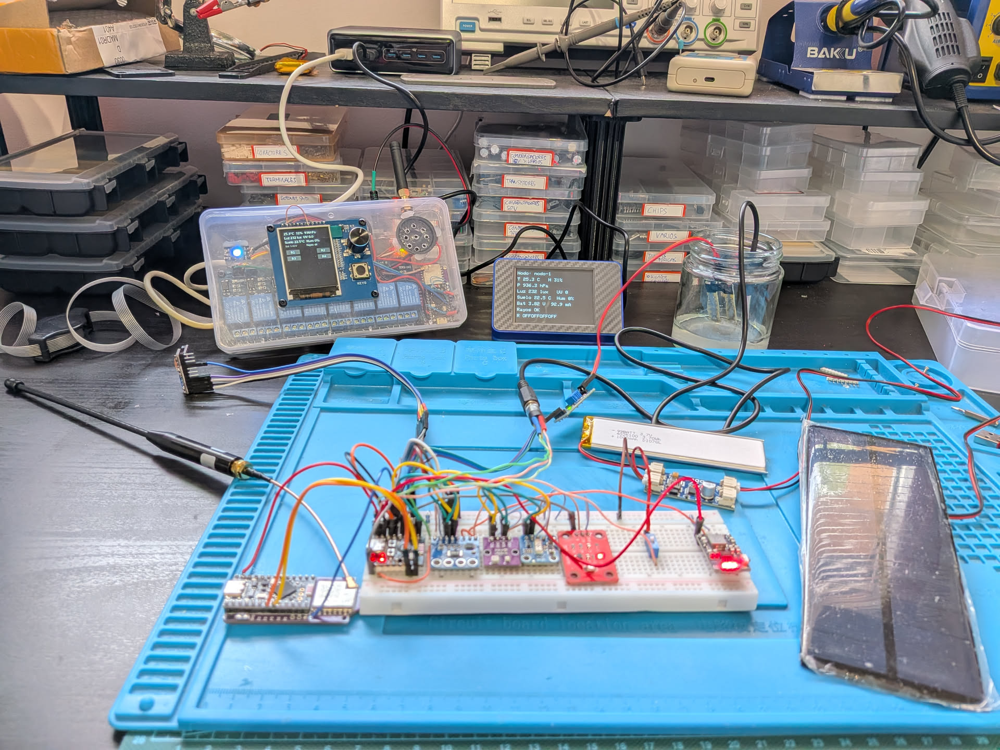

# Estación Agrícola Autónoma

Sistema de medición ambiental y del suelo para huertas al aire libre, construido como práctica final de **Sistemas Digitales para el Internet de las Cosas** y continuado en **Comunicaciones Inalámbricas y Protocolos para el Internet de las Cosas** (micromáster IoT, UNED, curso 2025/2026).



## Qué hace

Un **nodo autónomo** (ESP32-C3 SuperMini) mide *in situ* temperatura y humedad ambientales, presión atmosférica, iluminación, índice UV, humedad y temperatura del suelo y proximidad de tormentas. Envía sus lecturas en JSON cada 30 s a una **estación base** (Raspberry Pi 1 Model B) mediante LoRa con placas Faketec y firmware Meshtastic, aunque el enlace es intercambiable: WiFi con MQTT, ESP-NOW o USB directo. La estación base publica todo en un broker **Mosquitto** local, muestra los datos en pantalla, acciona relés, emite avisos de voz y los sube a la nube (Ubidots). Una **estación auxiliar** (Cheap Yellow Display o CYD) se conecta por WiFi al mismo broker para mostrar la telemetría y el estado de los relés en tiempo real.

## Estado del proyecto

- **Práctica Sistemas Digitales**: etiqueta [`sistemas-digitales-final`](https://github.com/alexprovencio/estacion-agricola/tree/sistemas-digitales-final).
- **Práctica Comunicaciones Inalámbricas**: rama `main`, memoria en [memoria-comunicaciones.md](docs/memoria-comunicaciones.md).

## Estructura del repositorio

```
├── nodo-autonomo/      Firmware del ESP32-C3 (pioarduino / Arduino), con varios targets de transporte
├── estacion-base/      Programa de la estación base (Python, paquete instalable) + broker Mosquitto
├── estacion-auxiliar/  Firmware del Cheap Yellow Display (ESP32 + TFT_eSPI)
├── puente-espnow/      Firmware del ESP32-C3 que hace de puente ESP-NOW
└── docs/               Memorias y material de referencia
```

## Documentación

Todo el detalle está en las memorias:

- [Memoria de Sistemas Digitales](docs/memoria-sistemas.md): arquitectura, sensores, conexiones, código, instalación y configuración del nodo y la estación base.
- [Memoria de Comunicaciones Inalámbricas](docs/memoria-comunicaciones.md): nodo solar, broker MQTT, enlaces WiFi/ESP-NOW/Meshtastic y comparación de prestaciones.
- [Diagrama de arquitectura](docs/arquitectura.mdd): flujo de datos entre nodo, gateway, broker, estación base y estación auxiliar.

## Nodo autónomo (firmware)

Proyecto [PlatformIO](https://platformio.org/) para el ESP32-C3 SuperMini con el framework Arduino y el fork `pioarduino` del core. Se compila y flashea con la extensión *pioarduino* de Visual Studio Code o desde terminal. El transporte se elige con el target de compilación:

```bash
cd nodo-autonomo
pio run -e esp32-c3-meshtastic --target upload   # LoRa/Meshtastic
pio run -e esp32-c3-wifi       --target upload   # WiFi + MQTT
pio run -e esp32-c3-espnow     --target upload   # ESP-NOW al puente
pio run -e esp32-c3-usb        --target upload   # USB-CDC directo a la base
```

El nodo se alimenta con panel solar y batería LiPo a través del cargador MPPT CN3791 y el convertidor MH-CD41, y mide su consumo con un INA226. Cada 30 s emite el payload JSON:

```json
{"nid":"nodo-1","seq":1,"t":31,"ta":25.9,"ha":30.1,"pa":935.1,"lx":771.8,"uv":23,"ts":24.1,"hs":2828,"vb":4,"ia":79.9,"pw":317.5,"re":"ok"}
```

La configuración (credenciales WiFi/MQTT, MAC del puente, canal ESP-NOW...) se copia de `include/secrets.h.example` a `include/secrets.h`. La lista de sensores, pines y librerías está en la [memoria](docs/memoria-comunicaciones.md#2-nodo-solar-autónomo).

## Estación base

Requisitos: Raspberry Pi con SPI y audio habilitados, las dependencias del sistema indicadas en la memoria, un broker **Mosquitto** local y Python 3.9 o superior.

```bash
cd estacion-base
python3 -m venv ~/venvs/estacion
source ~/venvs/estacion/bin/activate
pip install --upgrade pip
pip install -e .
cp .env.example .env          # tokens de Ubidots y credenciales del broker
sudo ~/venvs/estacion/bin/python -m estacion_base
```

Se ejecuta como `root` por el uso de DMA de la librería *neopixel* (ver memoria). El programa:

- Lee el nodo por el puerto serie (USB, puente ESP-NOW o Faketec Meshtastic) con el inyector `gateway_serial.py`, o directamente del broker si el nodo usa WiFi (`ENLACE_NODO=mqtt`), y publica en `esagrau/nodos/+/telemetria`.
- Se suscribe al broker local (TLS en el puerto `8883`) para procesar la telemetría y el estado de los relés.
- Dibuja en la pantalla, gestiona relés, encoder y avisos de voz, ejecuta automatismos locales y comunica con Ubidots cada 30 s.

## Estación auxiliar

Firmware para el Cheap Yellow Display (ESP32 con pantalla ILI9341 y TFT_eSPI). Se conecta por WiFi al broker de la estación base (puerto `1883`, sin TLS por limitaciones de la librería *AsyncMqttClient* en el ESP32) y se suscribe a `esagrau/nodos/+/telemetria` y `esagrau/base/estado` para mostrar las variables del nodo y el estado de los relés en tiempo real. Configuración en `include/secrets.h` (a partir de `secrets.h.example`).

```bash
cd estacion-auxiliar
pio run --target upload
```

## Puente ESP-NOW

Firmware para un segundo ESP32-C3 que recibe la telemetría del nodo por ESP-NOW y la reenvía por USB-CDC a la estación base, que la inyecta en el broker. Configuración en `include/secrets.h` (canal WiFi y MAC del nodo).

```bash
cd puente-espnow
pio run --target upload
```

## Broker MQTT

La estación base ejecuta un broker *Mosquitto* con un prefijo común `esagrau` (EStación AGRícola AUtónoma):

| Tema | Uso |
| :--- | :--- |
| `esagrau/nodos/{id}/telemetria` | Lecturas del nodo (QoS 1). |
| `esagrau/nodos/{id}/estado` | Presencia del nodo (retain, LWT en modo WiFi). |
| `esagrau/nodos/{id}/control` | Control puntual del nodo (uso futuro). |
| `esagrau/base/estado` | Estado de los relés de la estación base (retain). |
| `esagrau/base/control` | Petición de cambio de relés (base, auxiliar, Ubidots). |

La configuración del broker (`/etc/mosquitto/conf.d/local.conf`), los certificados y los usuarios se detallan en la [memoria](docs/memoria-comunicaciones.md#31-configuración-del-broker-mqtt).

## Conexiones

Los esquemas completos se generaron con Cirkit Designer y se citan en la [memoria de Sistemas Digitales](docs/memoria-sistemas.md), junto con la lista de pines del nodo (entradas analógicas, bus I2C, OneWire e interrupciones) y de la estación base (SPI para la pantalla, pines de relés, LED y botones). El nodo solar añade la etapa de alimentación (CN3791 + MH-CD41 + INA226) y las placas Faketec para LoRa.

## Configuración de Ubidots

La estación base publica en dos dispositivos separados: `nodo-1` con las lecturas de los sensores y `estacion-base` con el estado de los relés, que además pueden activarse a distancia desde el panel. Más detalle en la [memoria](docs/memoria-sistemas.md#4-plataforma-iot-en-la-nube-ubidots).

## Mejoras previstas

Las líneas de trabajo futuras están recogidas en las conclusiones de la [memoria de Comunicaciones Inalámbricas](docs/memoria-comunicaciones.md#6-conclusiones-y-mejoras-futuras) (pruebas en campo abierto, PCBs propios, carcasas 3D, escalabilidad a varios nodos, etc.) y de la [memoria de Sistemas Digitales](docs/memoria-sistemas.md#5-conclusiones-y-mejoras-futuras).
