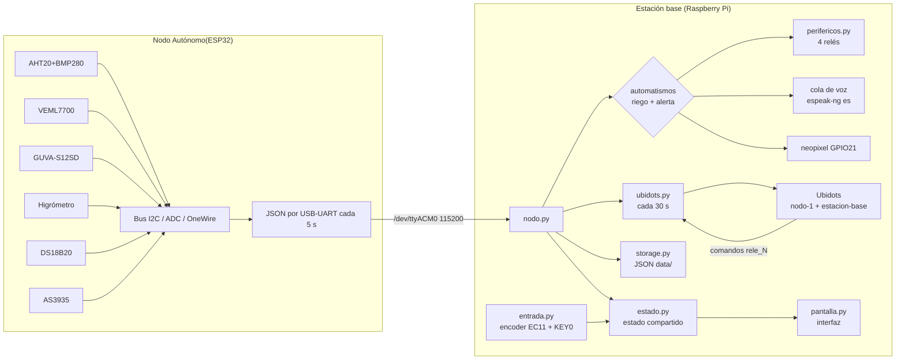

```mermaid
flowchart LR
    subgraph Nodo["Nodo Autónomo(ESP32)"]
        S1[AHT20+BMP280] & S2[VEML7700] & S3[GUVA-S12SD] & S4[Higrómetro] & S5[DS18B20] & S6[AS3935] --> I2C_S[Bus I2C / ADC / OneWire]
        I2C_S --> JSON[JSON por USB-UART cada 5 s]
    end

    subgraph Estacion["Estación base (Raspberry Pi)"]
        JSON -->|/dev/ttyACM0 115200| NODO[nodo.py]
        NODO --> ESTADO[estado.py<br/>estado compartido]
        NODO --> AUTO{automatismos<br/>riego + alerta}
        AUTO --> RELES[perifericos.py<br/>4 relés]
        AUTO --> VOZ[cola de voz<br/>espeak-ng es]
        AUTO --> LED[neopixel GPIO21]
        NODO --> STORE[storage.py<br/>JSON data/]
        NODO --> NUBE[ubidots.py<br/>cada 30 s]
        NUBE --> UBI[ Ubidots<br/>nodo-1 + estacion-base]
        UBI -->|comandos rele_N| NUBE

        ENTRADAS[entrada.py<br/>encoder EC11 + KEY0] --> ESTADO
        ESTADO --> DIBUJO[pantalla.py<br/>interfaz]
    end
```