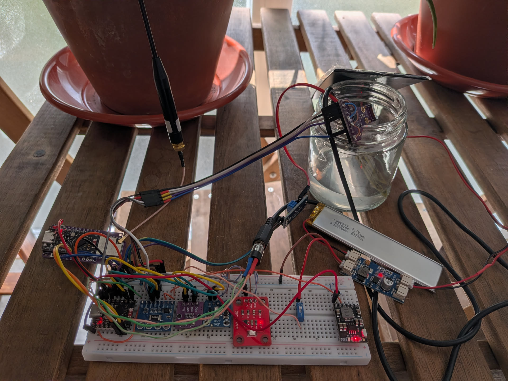
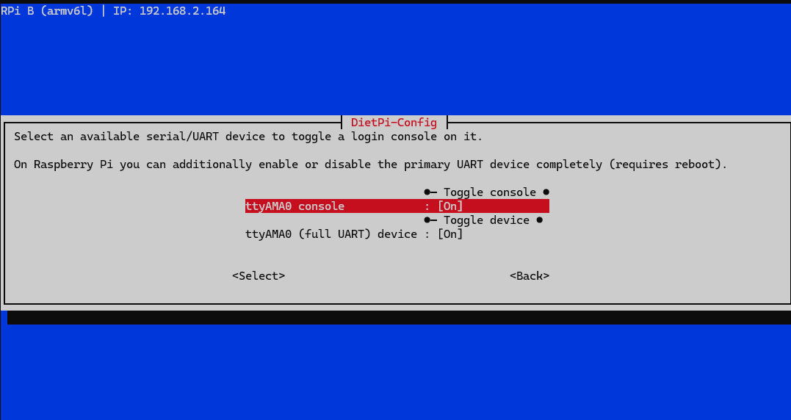
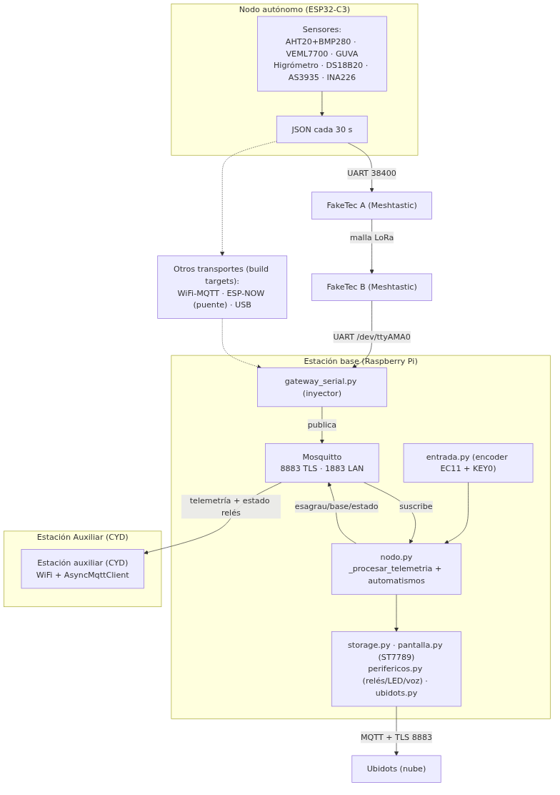
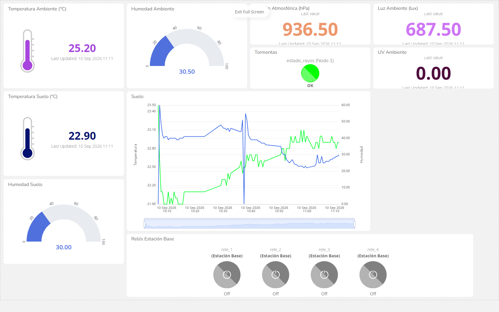
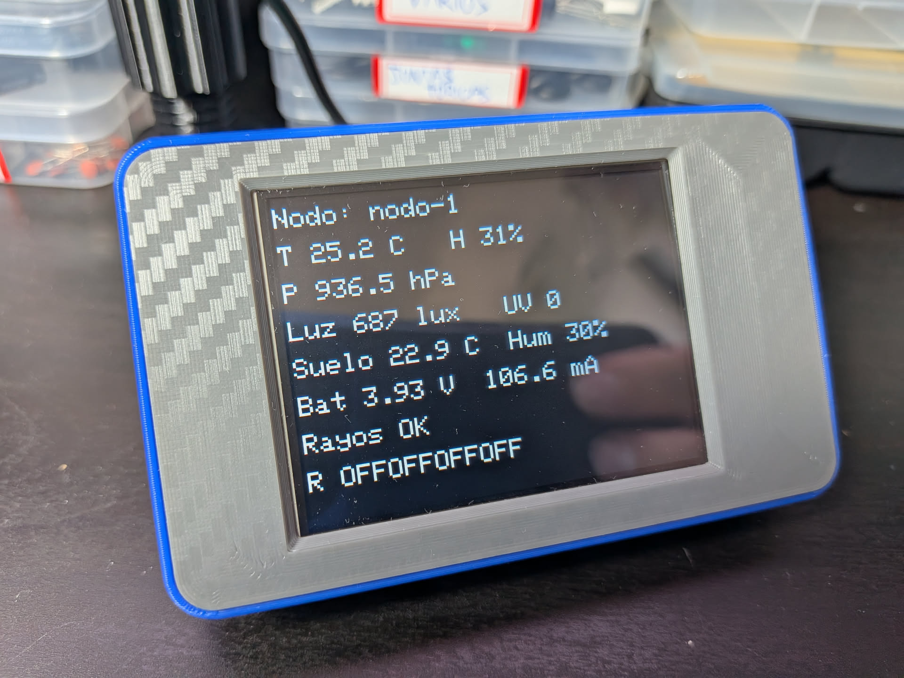
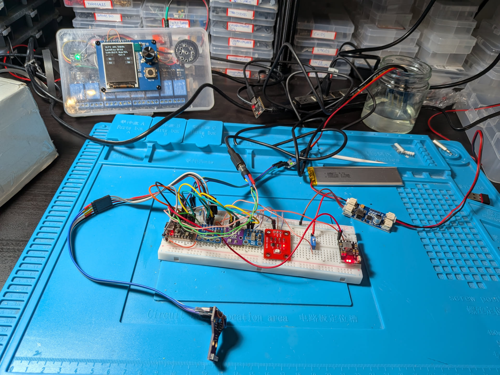
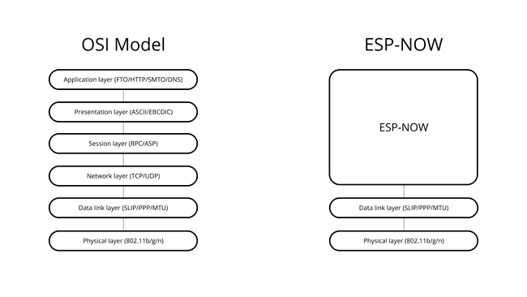
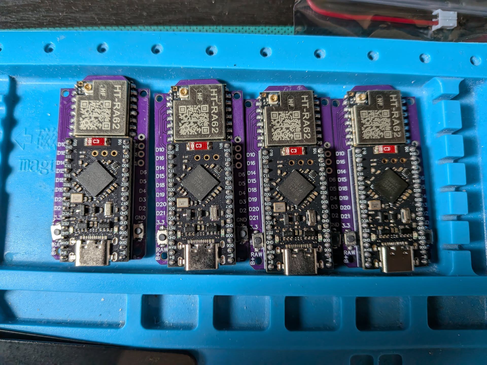
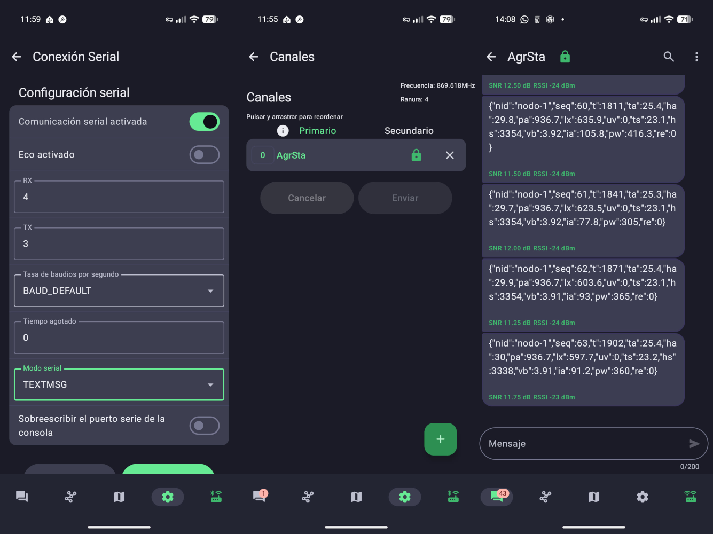

# 1. Introducción

Esta práctica continúa la realizada en la asignatura de Sistemas Digitales para el Internet de las Cosas. Consiste en el desarrollo de un sistema completo de mediciones ambientales y del suelo para agricultura inteligente para su uso en huertas, viveros, invernaderos o cultivos extensos, fundamentalmente de regadío.

El sistema realiza las siguientes mediciones mediante un nodo autónomo instalado *in situ*:

- Temperatura ambiente: para detectar estrés térmico por calor o frío excesivos y predecir heladas.
- Humedad relativa del aire: podemos anticipar la aparición de enfermedades debidas a la alta humedad y, combinado con la temperatura, calcular la transpiración de las plantas con el fin de dimensionar el riego.
- Presión atmosférica: ayuda a la previsión meteorológica local, por ejemplo, una rápida caída de la presión puede indicar lluvia, viento o una tormenta.
- Iluminación incluyendo IR: ayuda a detectar exceso o déficit de luz en las plantas, lo que puede alterar su crecimiento. En un invernadero o cultivo bajo cubierta serviría para ajustar la iluminación artificial.[^1]
- Índice UV: afecta a la calidad, sabor y conservación de los frutos, además, lo podemos usar para proteger a los operarios los días de mayor incidencia o regular el uso de lámparas UVA en cultivos de interior.[^2]
- Proximidad de tormentas: nos puede servir para recolectar los frutos antes de la llegada de la tormenta evitando su deterioro a causa del granizo o la lluvia excesiva, también a preparar nuestros cultivos ante la tormenta, y puede evitar gastos innecesarios derivados de la aplicación de fitosanitarios que se desperdiciarían si se aplican justo antes de la lluvia.
- Temperatura del suelo: nos ayuda a encontrar el momento óptimo para la siembra, puede servirnos para calcular la disponibilidad de nutrientes y detectar riesgos de heladas.[^3]
- Humedad del suelo: fundamentalmente nos indica cuando regar, evitando riego en exceso o defecto, ahorrando agua y detectando problemas de drenaje.

Todas estas mediciones las realiza un nodo autónomo (ESP32-C3 SuperMini), equipado con un panel solar y una batería de litio, que se instala en la zona a medir y cuyos datos se envían a una estación base (Raspberry Pi 1 Model B) para su procesamiento y envío a una plataforma IoT en la nube (*Ubidots*) para su análisis.

La estación base dispone a su vez de una pantalla para visualización de los datos y/o alertas del sistema, botones que controlan una serie de relés que podrían usarse para activar bombas de riego, luces... y un altavoz que emite alertas (por ejemplo ante la proximidad de una tormenta) y avisos.

También se ha creado una estación auxiliar que muestra los datos del nodo autónomo y el estado de los relés de la estación base en tiempo real.

Finalmente la comunicación entre el nodo autónomo y la estación base se realiza mediante LoRa usando dispositivos auxiliares con Meshtastic[^4] conectados por UART. La estación base, que usa un broker MQTT local, está conectada por ethernet a mi red local y la estación auxiliar se conecta por WiFi a este broker para obtener los datos del sistema y mostrarlos.

{width=600px}

# 2. Nodo solar autónomo

El nodo autónomo, gobernado por un ESP32-C3 Supermini de TENSTAR ROBOT[^5], cuenta con los siguiente sensores de ambiente/suelo:

- Sensor AHT20+BMP280: mide temperatura, humedad relativa y presión atmosférica ambientales. El módulo que tengo combina ambos sensores y funciona por I2C.
- Sensor VEML7700: mide la luz ambiental real de forma lineal y con alta precisión y funciona por I2C. Rango de medición de 0 a 120.000 lux, detecta luz visible e IR.
- Sensor GUVA-S12SD: calcula el índice UV para luces de longitudes de onda de 240 nm a 370 nm con salida analógica y salida entre 0 y 1 V.
- Sensor AS3935: usado para detectar rayos y estimar la distancia a la tormenta. Puede detectar rayos hasta a 40 km con una precisión de 1 km en 14 pasos. Tiene un pin de alerta que conecto al ESP32-C3 para avisar de descargas en tiempo real mediante el uso de una interrupción y la lectura de un registro. Se puede conectar usando SPI o I2C, lo conecto usando I2C.
- Higrómetro de suelo FC-28: mide la humedad de la tierra usando un sensor simple por variación de conductividad. Uso la salida analógica con el ADC de 12 bits del ESP32-C3 para obtener valores entre 0 y 4096.
- Sonda Sumergible DS18B20: mide la temperatura, lo emplearemos enterrado en la tierra. Usa el protocolo *OneWire*.

Los siguientes componentes encargados de la alimentación:

- Sensor INA226: mide voltaje y corriente de la batería de litio conectada al sistema para calcular su carga y lo que consumimos. Funciona mediante I2C. Al hacer pruebas vi que el INA226 no me devolvía datos de corriente, no había iniciado bien la librería con el registro de calibración: el valor del shunt que en mi módulo es 0.1 Ω y la corriente máxima medible que según he visto es alrededor de 0.8A.
- Convertidor/Cargador MH-CD41: este módulo permite cargar baterías y además integra un convertidor a 5V, botón de encendido/apagado e indicador de carga. No lo empleo para cargar la batería, de eso se encarga el siguiente módulo.
- Cargador solar MPPT CN3791: eficiente módulo controlador de punto de máxima potencia para cargar baterías LiPo 1S desde un panel solar.
- Batería: LiPo de 1Ah a 3,7V para las pruebas.
- Panel solar: 165x65 mm de tamaño a 6V con una salida máxima de 250 mA (1.5 W) para las pruebas.

Y para las comunicaciones con la estación base:

- Faketec V4[^5]: PCB con una placa de desarrollo con un nRF52840[^6] y una radio HT-RA62 [^7] LoRa y firmware Meshtastic. Conectada por UART y que hace de pasarela con otra placa idéntica conectada a la estación base.

{width=600px}

# 3. Estación base

La estación base, controlada por una Raspberry Pi 1 Model B tiene los siguientes periféricos conectados mediante GPIO:

- Pantalla: la empleo para mostrar los datos recibidos del nodo, incluyendo alertas, y controlar los relés conectados a la estación base. Uso un módulo con una pantalla de 2 pulgadas con un codificador rotatorio y un botón extra integrados. Se conecta por SPI.
- LED de estado: empleado para indicar el estado del sistema. Uso un WS2812B conectado directamente.
- Amplificador y altavoz: usados para emitir alertas y avisos. Empleo un módulo con un PAM8302A, conectado al jack de 3,5 mm y a un pequeño altavoz de 8 Ω y 0,5 W.
- Relés: uso también un módulo con 8 relés para simular la apertura de válvulas de riego y la activación de otros sistemas. Solo conecto 4 de los relés, más que suficientes para realizar pruebas, y uso sus LEDs de estado para comprobar que funcionan correctamente.
- Faketec V4: idéntico al del nodo autónomo, conectado por UART usando los GPIO de la Raspberry Pi. Hay que activar el puerto y deshabilitar la consola en la configuración de DietPi.

{width=400px}

## 3.1. Configuración del broker MQTT

Instalo un broker *mosquitto*[^8] en la Raspberry Pi. Lo hago usando el gestor de software de DietPi. El proceso de instalación se detalló en la Práctica 1 de la asignatura. Agrego mi propia configuración en `/etc/mosquitto/conf.d/local.conf` para hacerlo más seguro, aunque como se ve he dejado la conexión insegura usando el puerto `1883` por simplicidad, lo ideal sería eliminarla y que todos los clientes se conectaran usando el puerto 8883.

```bash
listener 1883 0.0.0.0
allow_anonymous false
password_file /etc/mosquitto/passwd

listener 8883 0.0.0.0
allow_anonymous false
cafile /etc/mosquitto/certs/ca.crt
certfile /etc/mosquitto/certs/server.crt
keyfile /etc/mosquitto/certs/server.key
require_certificate false
tls_version tlsv1.2
```

Creo usuarios y contraseñas para `nodo-1`, `estacion-base` y `estacion-aux` usando `mosquitto_passwd`. Genero los certificados autofirmados pertinentes para la conexión segura y finalmente reinicio el broker usando `sudo dietpi-services restart mosquitto`. El único cliente que usa la conexión segura con el broker MQTT es la propia estación base en local debido a las limitaciones de tiempo que tenía y de los problemas que me dio la librería para manejo de MQTT que usé en los ESP32.

A continuación paso a diseñar los temas que usaré para todos los dispositivos que se conectan a este broker. Uso *ESAGRAU* como prefijo diferenciador, significando las siglas EStación AGRícola AUtónoma:

| Tema | Dirección | QoS | Retain | Payload (ejemplo) | Descripción |
| :--- | :---: | :---: | :---: | :--- | :--- |
| `esagrau/nodos/{id}/telemetria` | Nodo → Base | 1 | No | `{"nid":"nodo-1","seq":1,"t":31,"ta":25.9...}` | Medida periódica cada 30 s. Las estaciones base y auxiliar son las suscriptoras (`esagrau/nodos/+/telemetria`). |
| `esagrau/nodos/{id}/estado` | Nodo → Base | 1 | Sí | `{"estado":"online","rssi":-42,"snr":3.5,"bateria":4.08}` o con LWT `{"estado":"offline"}` | Presencia. Con `retain` la estación sabe si el nodo está vivo al reconectar. Se usa como *Last Will* de MQTT solo para el modo WiFi. |
| `esagrau/nodos/{id}/control` | Base → Nodo | 1 | No | `{"accion":"reboot"}` / `{"accion":"set","param":"interval","valor":10}` | Control puntual de los nodos. Para uso futuro |
| `esagrau/base/estado` | Base → Auxiliar, Ubidot y Base | 0 | Sí | `{"rele_1":1,"rele_2":0,...}` | Estado de la estación base para la estación auxiliar, Ubidots y la propia estación base  |
| `esagrau/base/control` | Auxiliar, Ubidots y Base → Base | 1 | No | `{"rele_1":0/1}` deseado | Solo la base, que es la que activa los relés, se suscribe.
| `esagrau/nodos/+/telemetria` | — | — | — | — | Comodín al que se suscribirán las estación base y auxiliares cuando haya varios nodos. |

De esta forma evitamos rebotes ya que el único cliente que lee de `esagrau/base/control` para activar los relés es la propia estación base, y la única que actualiza el estado real de los relés en `esagrau/base/estado` también es la propia estación base.

## 3.2. Programa de monitorización y control

La parte de la pantalla, botones y sonido no ha sufrido cambios relevantes, solo adaptaciones. Se ha creado una parte nueva encargada de la medición de la calidad de conexión cuando se usa enlace por WiFi y una puerta de enlace que lee la telemetría que llega por puerto serie (enlace por USB, ESP-NOW o Meshtastic) y la publica en el broker local. Así hacemos el resto del programa transparente al método de enlace entre la estación base y el nodo autónomo.

Uso la versión 2.x de la librería `paho-mqtt`[^9] para comunicarme con mi broker local Mosquitto de forma segura, al menos desde la propia estación base. Se controlan las posibles excepciones y se mejora la detección de presencia del nodo autónomo y su reconexión.

{width=700px}

# 3.3 Comunicación con Ubidots

Pasamos a usar MQTT para conectarnos, ahora tanto las alertas de rayos como el estado y control de los relés se actualizan al momento.

{width=800px}

# 4. Estación auxiliar

Uso un Cheap Yellow Display[^10] para mostrar los datos que muestra la pantalla de la estación base. El CYD se conecta por WiFi a la misma red local donde está conectada la estación base y accede a su broker Mosquitto para recibir datos.

{width=400px}

El programa es sencillo y la conexión con el servidor MQTT se hace usando usuario y contraseña pero en plano por el puerto 1883 por limitaciones de tiempo y porque la librería que empleo[^11] para conectarme en teoría debería soportar la conexión segura usando SSL/TLS pero en la práctica no funciona, al menos con mi ESP32. 

# 5. Comunicación del nodo autónomo con la estación base

El sistema desarrollado para la anterior práctica usaba el puerto USB para comunicarse con la estación base. Para esta ocasión hemos realizado pruebas con WiFi, usando un broker MQTT instalado en la propia estación base, ESP-NOW y finalmente LoRa con Meshtastic.

Tras varias iteraciones para reducir su tamaño debido a problemas de transmisión (especialmente con Meshtastic) finalmente uso este formato de payload que transmito a la estación base:

```json
{"nid":"nodo-1","seq":1,"t":31,"ta":25.9,"ha":30.1,"pa":935.1,"lx":771.8,"uv":23,"ts":24.1,"hs":2828,"vb":4,"ia":79.9,"pw":317.5,"re":"ok"}
```

| Campo | Tipo | Descripción |
|-------|------|-------------|
| `nid` | string | id del nodo autónomo |
| `seq` | int | número del paquete para detectar pérdidas en las pruebas |
| `t` | int | tiempo de actividad del nodo en segundos (`millis()/1000`) |
| `ta` | float °C | temperatura ambiente (AHT20) |
| `ha` | float % | humedad relativa ambiente (AHT20) |
| `pa` | float hPa | presión atmosférica (BMP280) |
| `lx` | float lux | iluminación (VEML7700) |
| `uv` | int 0-4095 | ADC raw del GUVA-S12SD |
| `ts` | float °C | temperatura del suelo (DS18B20) |
| `hs` | int 0-4095 | ADC raw del higrómetro |
| `vb` | float V | tensión de la batería (INA226) |
| `ia` | float mA | corriente de la batería (INA226) |
| `pw` | float mW | carga del sistema (INA226) |
| `re` | int | `0-ok` \| `1-ruido` \| `2-disturber` \| `3-rayo` (AS3935) |
| `rd` | int km | distancia al frente de tormenta (solo si `estado`=3`) |

Paso a continuación a comentar los detalles de implementación de los diferentes métodos de comunicación probados.

## 5.1. UART por USB

Inicialmente usé la conexión por USB que ya tenía en la práctica de Sistemas Digitales para el Internet de las Cosas y comprobé que funcionaba bien el cambio a MQTT tanto en la estación base como en Ubidots.

## 5.2. WiFi

Empleo directamente el broker MQTT de la estación base con la librería *AsyncMqttClient*. Uso el ejemplo disponible para el ESP32[^12] para realizar mi implementación. Iba a usar los *timers* de *FreeRTOS* invocados expresamente para realizar reconexiones sin bloquear el *loop* principal y no tener que crear hilos tal como se hace en el ejemplo, pero me enteré de que el núcleo de ESP32 para Arduino ya corre de forma nativa sobre FreeRTOS[^13]. Yo he usado FreeRTOS antes en microcontroladores STM32, por lo que la integración nativa en los ESP32 es una buena noticia, le sacaré partido de aquí en adelante.

Para las pruebas con el WiFi uso la librería integrada en el núcleo del ESP32[^14] y creo un AP en el nodo autónomo al que se conectará la estación base. Hay que prestar atención a no configurar un gateway para esta conexión o perderemos la conexión a internet por ethernet.

Para empezar la Raspberry Pi daba problemas de alimentación con el WiFi USB, lo tengo que conectar con ella apagada y aun así hay veces que no lo reconoce o que no conecta si el nodo no estaba encendido antes. No me avisa por pantalla cuando el nodo se desconecta, lo cambio usando un dibujo similar al de rayo y un aviso sonoro. Uso el LWT del broker MQTT para detectar el estado desconectado del nodo autónomo.

Pongo un hub USB alimentando tanto a la RPi como al USB WiFi y a todo lo que conecte por USB y así el sistema es más estable.

## 5.3. ESP-NOW

Para la comunicación por ESP-NOW[^15], nativa de los ESP32, empleo otro ESP32-C3 idéntico al que gobierna el nodo autónomo conectado por USB a la estación base. El nodo autónomo mandará la telemetría que la estación base leerá a través de esta puerta de enlace por el puerto serie de manera análoga a como lo hacíamos con la conexión directa por USB.

Al implementar la comunicación usando este protocolo me di cuenta de que PlatformIO no actualizaba ya el core Arduino del ESP32 debido a problemas entre las empresas[^16]. Pasé aquí a usar el fork *pioarduino*[^17] que incluye el último core con soporte para ESP-NOW v2.0 y que me permite un mayor tamaño del payload.



Al no ser ESP-NOW un protocolo IP, sino enlace punto a punto connectionless, necesitamos un gateway que traduzca a IP para mandar la telemetría recibida al broker. Usamos para ello la propia estación base y así el código nos vale para republicar lo que recibimos del Faketec con enlace usando Meshtastic y retroactivamente lo usamos para conexión directa usando USB. Como ventaja, la comunicación se siente muy rápida, sin los problemas de conexión que daba WiFi y con reconexión inmediata.

{width=700px}

## 5.4. Meshtastic

Para la comunicación por LoRa usando Meshtastic empleo dos Faketec V4 con nRF52840 y firmware Meshtastic que tenía hechos anteriormente y que servirán de pasarelas entre el nodo autónomo y la estación base.

{width=400px}

Uso la app de Meshtastic desde el móvil para configurar los Faketec con un canal principal que compartirán y su respectiva clave, activo también el puerto serie[^18] y configuro los pines que se usarán para comunicarse con la Raspberry Pi y el ESP32-C3 y el modo TEXTMSG, que reenvía por el canal principal todo lo que recibe por el puerto serie y viceversa.

{width=600px}

Inicialmente me fallaba la transmisión cuando usaba batería en el nodo autónomo porque el payload era grande y sobrepasaba el límite de 240 Bytes de Meshtastic, lo compacté redondeando floats a 1 decimal (excepto para la tensión de la batería).

Ahora mismo mandamos los datos del nodo autónomo cada 30 segundos, en realidad debería ser cada más tiempo. Surgió un problema debido a que este es el tiempo que tardamos en leer el registro de interrupción del sensor de rayos, si después de un rayo hay interferencias o ruido, perdemos el evento de rayo detectado anteriormente. Lo corrijo guardando en un registro temporal el dato más crítico del registro de interrupción para enviarlo con el siguiente paquete. Lo hago como tarea porque hacerlo directamente en el ISR no es correcto al tener que leer el I2C.

## 5.5. Comparación entre métodos de comunicación

Implementé el campo `seq` con números secuenciales en el payload para saber si perdemos paquetes y cree un par de scripts para analizar los logs que guardamos y extraer de ellos valores que nos sirvan para comparar los diferentes métodos de comunicación entre el nodo autónomo y la estación base.

Todas las pruebas se ejecutan durante 10 minutos, la frecuencia de envío de telemetría es de 5 segundos para todos lo métodos menos para Meshtastic donde es de 30 segundos.

Para el WiFi ejecuté a la vez pings para comprobar latencias y pérdida de paquetes y un *scan* para ver cuántas redes había y qué canales usaban. El nivel RSSI para Meshtastic es aproximado sacado de los datos de los paquetes.

| prueba | dist | n_rx | PDR% | perd | dt med/p95 s | RSSI med/min (n) | ping loss% | RTT min/avg/max/mdev ms | Vbat | I mA | APs | canales |
|---|---|---|---|---|---|---|---|---|---|---|---|---|
| T0_0m_WiFi | 0.3 | 115 | 100.0 | 0 | 5.17/5.19 | -39.0/-42 (n=115) | 0.0 | 1.665/3.222/61.454/3.531 | 3.81 | 182.25 | 25 | [1, 2, 4, 6, 10, 11] |
| T1_10m_LOS_WiFi | 10 | 116 | 100.0 | 0 | 5.17/5.21 | -69.8/-78 (n=116) | 0.0 | 4.067/15.569/93.774/10.148 | 3.8 | 183.94 | 11 | [1, 2, 4, 6, 10, 11] |
| T2_10m_VLOS_WiFi | 10 | 115 | 100.0 | 0 | 5.17/5.2 | -73.3/-76 (n=115) | 0.333333 | 2.577/7.344/212.359/11.513 | 3.75 | 186.2 | 11 | [1, 2, 4, 6, 10, 11] |
| T5_usb | 0.3 | 116 | 100.0 | 0 | 5.17/5.18 | None/None (n=0) | - | -/-/-/- | - | - | - | - |
| T6_0m_ESP-NOW | 0.3 | 116 | 100.0 | 0 | 5.17/5.43 | -48.1/-50 (n=116) | - | -/-/-/- | 3.71 | 182.09 | - | - |
| T7_10m_LOS_ESP-NOW | 10 | 115 | 100.0 | 0 | 5.17/5.46 | -79.6/-88 (n=115) | - | -/-/-/- | 3.72 | 178.68 | - | - |
| T8_10m_VLOS_ESP-NOW | 10 | 116 | 100.0 | 0 | 5.17/5.42 | -78.0/-82 (n=116) | - | -/-/-/- | 3.7 | 180.66 | - | - |
| T11_0m_Meshtastic | 0.3 | 20 | 100.0 | 0 | 30.17/30.48 | -36/-41 (n=20) | - | -/-/-/- | 3.87 | 83.03 | - | - |
| T12_10m_Meshtastic | 10 | 20 | 100.0 | 0 | 30.18/30.36 | -23/-24 (n=20) | - | -/-/-/- | 3.95 | 89.97 | - | - |
| T13_10m_VLOS_Meshtastic | 10 | 20 | 100.0 | 0 | 30.18/30.54 | -23/-24 (n=20) | - | -/-/-/- | 3.93 | 92.91 | - | - |

Notas:
- T0_0m_WiFi: lado a lado
- T1_10m_LOS_WiFi: LOS
- T2_10m_VLOS_WiFi: VLOS
- T5_usb: usb directo
- T6_0m_ESP-NOW: ESP-NOW lado a lado
- T7_10m_LOS_ESP-NOW: ESP-NOW línea con visión directa
- T8_10m_VLOS_ESP-NOW: ESP-NOW línea con una puerta cerrada en medio
- T11_0m_Meshtastic: Meshtastic lado a lado
- T12_10m_Meshtastic: Meshtastic línea con visión directa
- T13_10m_VLOS_Meshtastic: Meshtastic línea con una puerta cerrada en medio

Como se puede comprobar, por limitaciones de tiempo no puede llevar al cabo las muy necesarias pruebas en campo abierto. De los resultados en interior podemos deducir que LoRa sería el mejor método de comunicación para distancias largas (yo he probado enlaces a 20 km sin problema), pese a su mayor *jitter*, además de que el nodo autónomo consume significamente menos que con los métodos que emplean WiFi.

# 6. Conclusiones y mejoras futuras

He empleado bastante más tiempo del que había planificado para realizar esta práctica, principalmente por los objetivos que me había marcado al principio, esto es, la prueba de varios sistemas de comunicación en vez de usar directamente Meshtastic, que era mi objetivo final.

Entre las mayores pérdidas de tiempo sin sentido está los problemas que me dio la conexión entre el ESP32-C3 y el Faketec porque estaba convencido de que la numeración de los pines en Meshtastic se correspondía con la impresa en la PCB donde van soldados los módulos, cuando en realidad su numeración es la del nRF52. Incluso tuve que emplear el osciloscopio porque no me creía que el ESP32 estuviera enviando nada por sus puertos.

Hay muchas mejoras que se pueden implementar en el sistema, entre ellas destaco:

- Mejorar la UI de la estación base, incluir RSSI y SNR del enlace Meshtastic.
- Usar el "sender:" que Meshtastic antepone a los mensajes que recibimos para identificar al nodo que los envía y quitar su id del payload.
- Cambiar el protocolo serie de los Faketec para usar *PROTO* en vez de *TEXTMSG* y exponer así su API completa.
- Probar el sistema con varios nodos autónomos para ver si es escalable.
- Modificar el programa de la estación base para que sea instalable como un servicio y se inicie automáticamente cada vez que la arranquemos y además podamos monitorizar su estado. Igualmente, cambiar la ubicación del log para usar los del sistema.
- Realizar cajas impresas en 3D diseñadas a medida tanto para el nodo autónomo, separando los sensores que necesitan estar en el exterior con sus propias carcasas, como para la estación base.
- Usar *mosfets*, como el Si2312, para apagar los sensores cuando no se utilizan en el nodo autónomo y así ahorrar energía.
- Añadir al nodo autónomo un sensor de pluviometría para registrar el nivel de lluvia y un anemómetro y veleta para registrar la velocidad y dirección del viento.
- Usar un ESP32-C6 reemplazando al ESP32-C3 empleado por ser la última versión de esta gama y tener mejor conectividad, aunque en principio nosotros no emplearemos ni WiFi ni Bluetooth para comunicarnos sí que se podría hacer algo usando la conexión Matter (IEEExxxx) integrada.
- Usar el microcontrolador del nodos autónomo para controlar el módulo de radio LoRa directamente sin necesidad de usar los Faketec.
- Firmware del nodo autónomo actualizable vía *OTA*, uso de *secure boot*.
- Usar mejores sensores de suelo ya que los empleados se corroen fácilmente como he comprobado.
- Crear PCBs para todo el sistema, especialmente para el nodo autónomo, y así reducir su tamaño y coste.
- Mejorar la estación auxiliar para incluir el accionamiento de los relés, la UI e integrar algún sensor que podamos mandar al broker MQTT de la estación base.
- Estudiar las implicaciones de usar una red pública para nuestros nodos, está muy bien para que el resto nos hagan relay, pero no es para nada recomendable sobrecargar la red con nuestras comunicaciones privadas. Al menos aumentar significativamente el tiempo entre lecturas.
- Modificar el firmware del nodo autónomo para que sus valores modificables de secrets.h sean configurables con software después de flashearlo con un firmware genérico poniéndolas como params.
- Posibilidad de mandar comandos desde la estación base, reinicios aunque sea, al nodo autónomo.
- Posibilidad de difundir los mensajes en un canal normal bajo petición expresa, en el canal Bots por ejemplo
- Posibilidad de transmitir también a la red mehstastic los datos ambientales y del INA226 que soporte el protocolo nativamente para que se muestren a todos los usuarios de la malla.

[^1]: UPRtek - El Espectro UVA en la Agricultura de Interior: Mejora de la calidad y el rendimiento de los cultivos con iluminación UV-A. Disponible en: <https://www.uprtek.com/es/blogs/indoor-agriculture-leveraging-the-power-of-uva-spectrum>. Accedido el 2/9/2026.
[^2]: Hydro Environment - Guía Práctica: La Importancia de la Luz en el Cultivo. Disponible en: <https://hydroenv.com.mx/guia-practica-la-importancia-de-la-luz-en-el-cultivo/>. Accedido el 2/9/2026.
[^3]: EOS Data Analytics - Temperatura Del Suelo Para La Siembra Y El Cultivo. Disponible en: <https://eos.com/es/blog/temperatura-del-suelo/>. Accedido el 2/9/2026.
[^4]: Comunidad Meshtastic España. Disponible en: <https://meshtastic.es/>. Accedido el 10/9/2026.
[^5]: TENSTAR ROBOT - Placa de desarrollo TENSTAR ROBOT ESP32 C3 SuperMini. Disponible en: <https://tenstar.pro/robot-esp32-c3-supermini/>. Accedido el 24/8/2026.
[^5]: GitHub - fakeTec_pcb. Disponible en: <https://github.com/gargomoma/fakeTec_pcb>. Accedido el 10/9/2026.
[^6]: nordicsemi.com - nRF52840 - Bluetooth SoC. Disponible en: <https://www.nordicsemi.com/Products/nRF52840>. Accedido el 10/9/2026.
[^7]: Heltec Automation - HT-RA62. Disponible en: <https://heltec.org/project/ht-ra62/>. Accedido el 10/9/2026.
[^8]: Eclipse Mosquitto - An open source MQTT broker. Disponible en: <https://mosquitto.org/>. Accedido el 10/9/2026.
[^9]: PyPi - paho-mqtt 2.1.0. Disponible en: <https://pypi.org/project/paho-mqtt/>. Accedido el 10/9/2026.
[^10]: GitHub - ESP32-Cheap-Yellow-Display. Disponible en: <https://github.com/witnessmenow/ESP32-Cheap-Yellow-Display>. Accedido el 10/9/2026.
[^11]: GitHub - async-mqtt-client. Disponible en: <https://github.com/marvinroger/async-mqtt-client>. Accedido el 10/9/2026.
[^12]: PlatformIO Registry - Examples · marvinroger/AsyncMqttClient. Disponible en: <https://registry.platformio.org/libraries/marvinroger/AsyncMqttClient/examples/FullyFeatured-ESP32/FullyFeatured-ESP32.ino>. Accedido el 10/9/2026.
[^13]: ESP-IDF Programming Guide latest documentation - FreeRTOS Overview - ESP32. Disponible en: <https://docs.espressif.com/projects/esp-idf/en/latest/esp32/api-reference/system/freertos.html>. Accedido el 10/9/2026.
[^14]: Arduino-ESP32 2.0.14 documentation - Wi-Fi API. Disponible en: <https://espressif-docs.readthedocs-hosted.com/projects/arduino-esp32/en/latest/api/wifi.html>. Accedido el 10/9/2026.
[^15]: ESP-IDF Programming Guide v6.1 documentation - ESP-NOW - ESP32-C3. Disponible en: <https://docs.espressif.com/projects/esp-idf/en/stable/esp32c3/api-reference/network/esp_now.html>. Accedido el 10/9/2026.
[^16]: GitHub platformio - Support Arduino ESP32 v3.0 based on ESP-IDF v5.1. Disponible en: <https://github.com/platformio/platform-espressif32/issues/1225#issuecomment-4216264938>. Accedido el 10/9/2026.
[^17]: GitHub - pioarduino. Disponible en: <https://github.com/pioarduino>. Accedido el 10/9/2026.
[^18]: Meshtastic - Serial Module Configuration. Disponible en: <https://meshtastic.org/docs/configuration/module/serial/>. Accedido el 10/9/2026.