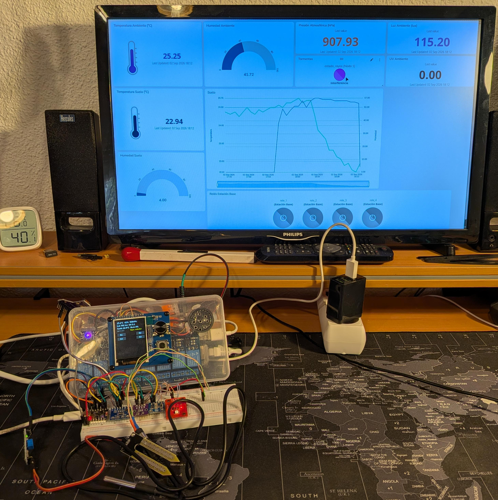
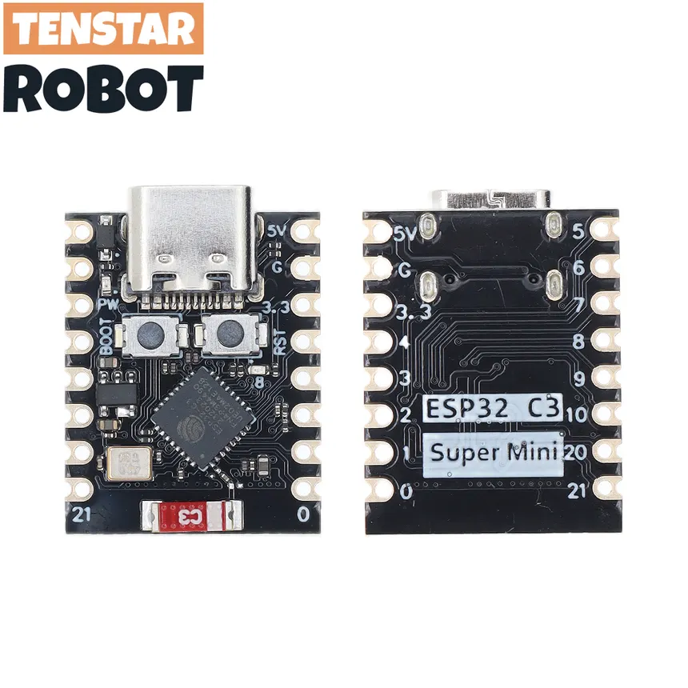
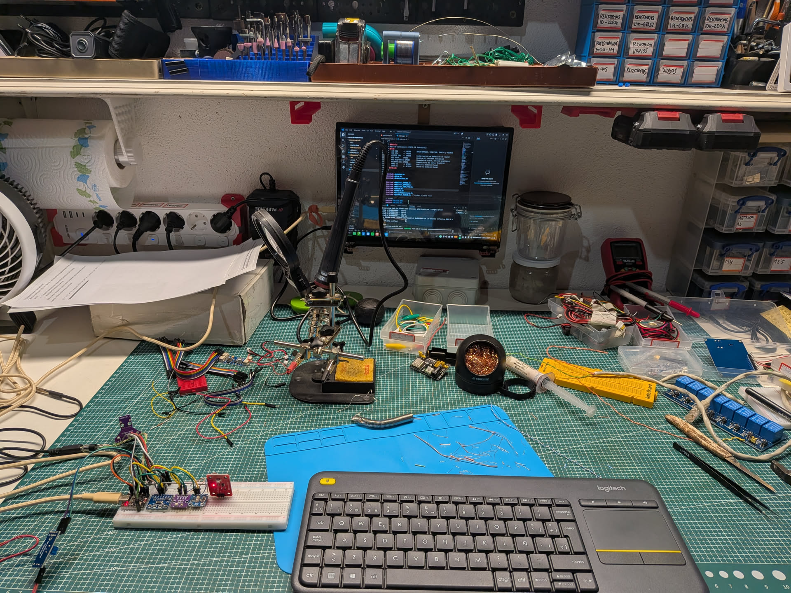
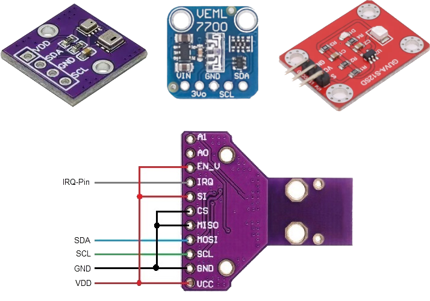
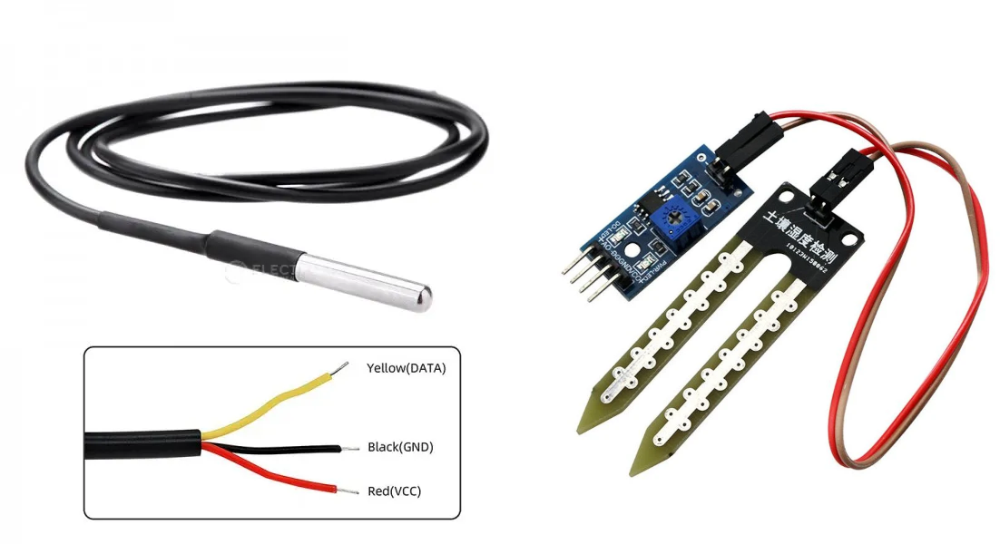
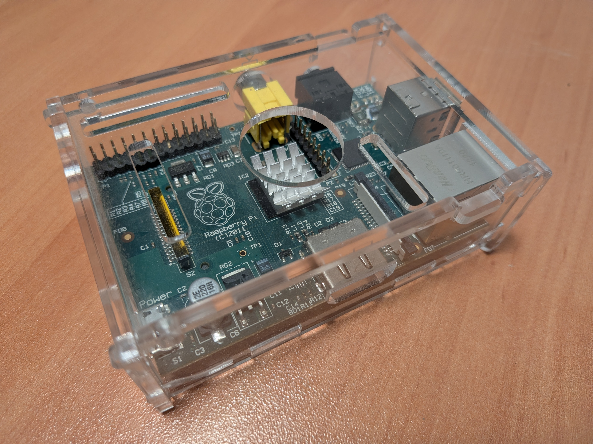
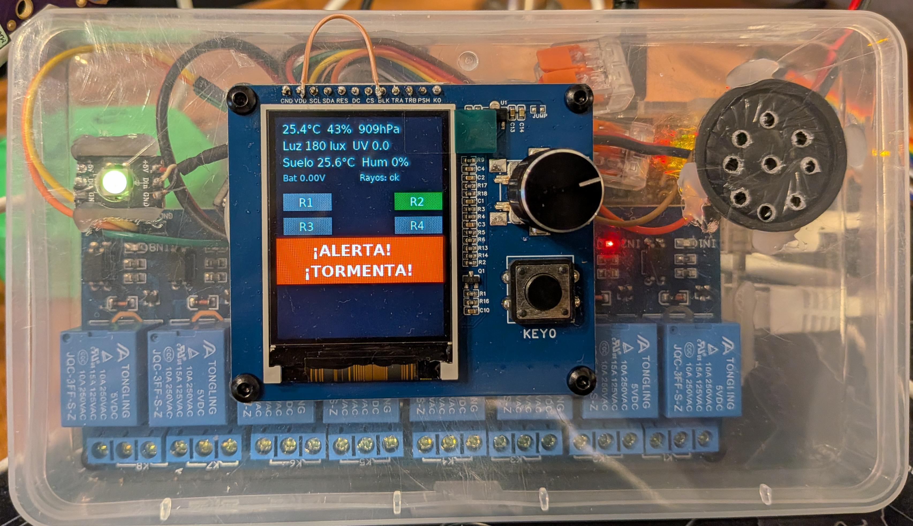
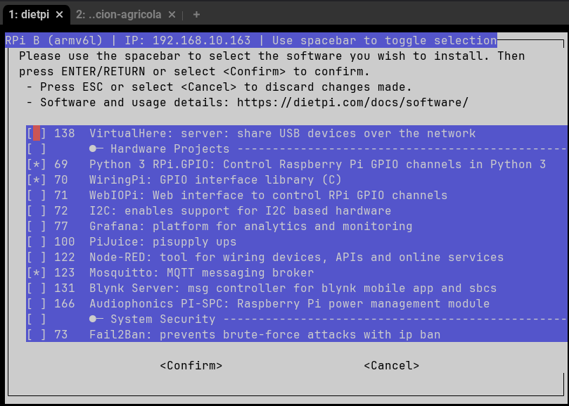
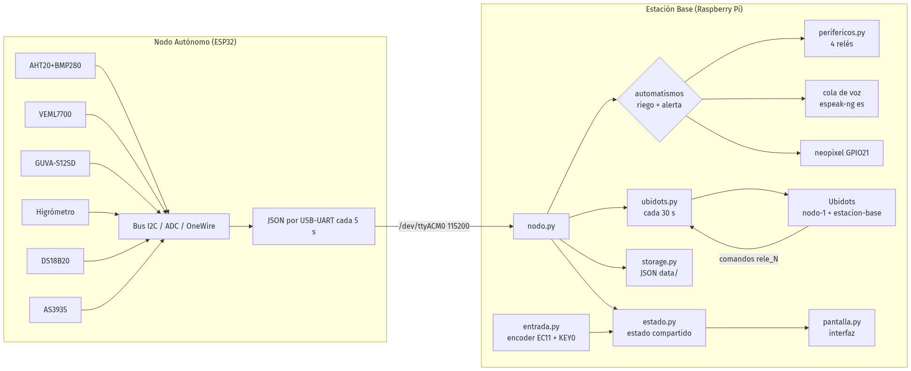
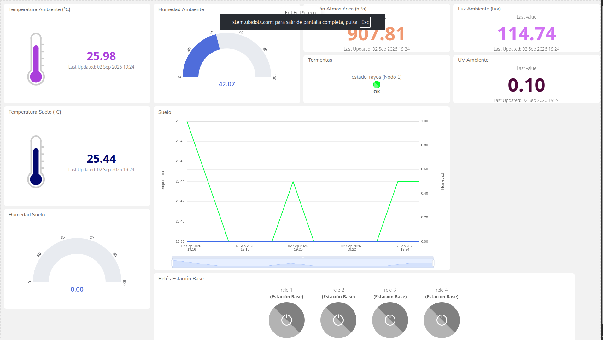

# 1.Introducción

La idea para este trabajo es realizar un sistema completo de mediciones ambientales y del suelo para agricultura inteligente, más orientada a horticultura o a regadío que a cultivos de cereales, aunque también sería aplicable. El sistema en principio lo he diseñado para usarlo en huertas al aire libre y realizará las siguientes mediciones mediante un nodo autónomo instalado *in situ*:

- Temperatura ambiente: para detectar estrés térmico por calor o frío excesivos y predecir heladas.
- Humedad relativa del aire: podemos anticipar la aparición de enfermedades debidas a la alta humedad y, combinado con la temperatura, calcular la transpiración de las plantas con el fin de dimensionar el riego.
- Presión atmosférica: ayuda a la previsión meteorológica local, por ejemplo, una rápida caída de la presión puede indicar lluvia, viento o una tormenta.
- Iluminación incluyendo IR: ayuda a detectar exceso o déficit de luz en las plantas, lo que puede alterar su crecimiento. En un invernadero o cultivo bajo cubierta serviría para ajustar la iluminación artificial.[^17]
- Índice UV: afecta a la calidad, sabor y conservación de los frutos, además, lo podemos usar para proteger a los operarios los días de mayor incidencia o regular el uso de lámparas UVA en cultivos de interior.[^16]
- Proximidad de tormentas: nos puede servir para recolectar los frutos antes de la llegada de la tormenta evitando su deterioro a causa del granizo o la lluvia excesiva, también a preparar nuestros cultivos ante la tormenta, y puede evitar gastos innecesarios derivados de la aplicación de fitosanitarios que se desperdiciarían si se aplican justo antes de la lluvia.
- Temperatura del suelo: nos ayuda a encontrar el momento óptimo para la siembra, puede servirnos para calcular la disponibilidad de nutrientes y detectar riesgos de heladas.[^18]
- Humedad del suelo: fundamentalmente nos indica cuando regar, evitando riego en exceso o defecto, ahorrando agua y detectando problemas de drenaje.

Todas estas mediciones serán efectuadas por un nodo autónomo (ESP32-C3 SuperMini) que se instalaría en la propia huerta y cuyos datos se enviarán a una estación base (Raspberry Pi 1 Model B) para su procesamiento y envío a una plataforma IoT en la nube (*Ubidots*) para su análisis.

La estación base dispondrá a su vez de una pantalla para visualización de los datos y/o alertas del sistema, botones que controlarán una serie de relés que, hipotéticamente, podrían activar bombas de riego, luces... y un altavoz que emitirá alertas (por ejemplo ante la proximidad de una tormenta) y avisos.

El sistema se diseñará, en esta primera etapa, con una conexión simple por el puerto USB entre el nodo autónomo y la estación base, con la idea de mejorar el sistema de comunicaciones entre ambos en la práctica final de la asignatura Comunicaciones Inalámbricas y Protocolos para el Internet de las Cosas. El diseño se ha hecho pensando que sea fácilmente escalable para que una sola estación base pueda gestionar múltiples nodos autónomos, aunque no lo he probado ni optimizado para ese caso.

Cabe señalar que he decidido aprovechar buena parte del hardware que ya tenía para realizar esta práctica para ponerla en funcionamiento y realizar pruebas con hardware real, lo cual me parece imprescindible.

{width=600px}

# 2.Nodo solar autónomo

El nodo solar autónomo está compuesto de un ESP32-C3 Supermini de TENSTAR ROBOT[^3] como unidad de procesamiento. Este microcontrolador tiene las siguientes características relevantes para nosotros:

- Procesador: CPU de 32 bits RISC-V con núcleo único, operando a una frecuencia de hasta 160 MHz.
- Memoria: 4 MB de memoria Flash integrada, 400 KB de SRAM y 384 KB de ROM.
- Conectividad: soporte integrado para Wi-Fi (protocolo 802.11 b/g/n en banda de 2.4 GHz) y Bluetooth 5.0 (BLE), con antena cerámica incorporada.
- Interfaces y Pines: 11 GPIOs digitales configurables (usables como PWM) y 4 entradas analógicas (ADC), además de interfaces UART, I2C, SPI e I2S.
- Alimentación y Consumo: se alimenta mediante puerto USB Tipo C (5V) o pines de 3.3V, destacando por un consumo ultra bajo en modo *deep sleep* de aproximadamente 43 µA.

{width=250px}

Usaré para programar la extensión *PlatformIO* de *VS Code* con el framework *Arduino*, que dispone de muchas librerías ya probadas para los sensores que emplearé.

{width=600px}

## 2.1.Sensores ambientales

A este microcontrolador conecto los siguientes sensores:

- AHT20+BMP280: mide temperatura, humedad relativa y presión atmosférica ambientales. El módulo que tengo combina ambos sensores y funciona por I2C. Uso las librerías de *Adafruit* para los *AHTX0*[^5] y para el *BMP280*[^6].

- VEML7700: mide la luz ambiental real de forma lineal y con alta precisión y funciona por I2C. Rango de medición de 0 a 120.000 lux, detecta luz visible e IR. Uso la librería de *Adafruit* para el *VEML7700*[^7].

- GUVA-S12SD: calcula el índice UV para luces de longitudes de onda de 240 nm a 370 nm con salida analógica y salida entre 0 y 1 V. Lo leo directamente usando un pin ADC y lo convierto suponiendo que 1 V equivale a un 10 en el índice de radiación ultravioleta.

- AS3935: usado para detectar rayos y estimar la distancia a la tormenta. Puede detectar rayos hasta a 40 km con una precisión de 1 km en 14 pasos. Tiene un pin de alerta que conecto al ESP32-C3 para avisar de descargas en tiempo real. Es sensible a las interferencias electromagnéticas (EMI) de los convertidores DC-DC, pantallas y el propio WiFi/Bluetooth del ESP32-C3 por lo que, idealmente, habría que situarlo en una caja estanca[^9] a cierta distancia del resto de componentes de nuestro nodo autónomo. Se puede conectar usando SPI o I2C, lo conecto usando I2C pese a que dicen que suele funcionar mejor usando SPI para economizar pines del microcontrolador. Uso la librería de *SparkFun*[^8] pese a que mi módulo (etiquetado como CJMCU[^10]) ni se parece al suyo, pero parece funcionar bien. Lo puedo activar usando el cuarzo de un mechero, o acercándolo a los propios relés y activándolos, así detecta a veces incluso un rayo para las pruebas, aunque la mayoría de las veces detecta solo interferencias o ruido, que internamente diferencia de los rayos de verdad usando algoritmos de validación de señal y picos configurables que yo, de momento, no he tocado.

{width=400px}

## 2.2.Sensores de suelo

- Higómetro de suelo FC-28: mide la humedad de la tierra usando un sensor simple por variación de conductividad[^11]. La placa de medición, que emplea un comparador LM393, devuelve valores analógicos o una señal alta digital cuando la humedad supera cierto umbral que podemos definir con un potenciómetro. Uso la salida analógica con el ADC de 12 bits del ESP32-C3 para obtener valores entre 0 y 4096. Metiendo el sensor en un vaso de agua calculo un valor de 1800 para 100% de humedad y 4096 para 0%, aunque tal como funciona este sensor sus mediciones solo deberían servirnos para saber si la tierra está húmeda o no, y no tener muy en cuenta el valor que devuelve.

- Sonda Sumergible DS18B20: mide la temperatura, en principio está diseñado para ser usado en el agua (yo los he usado en acuarios), pero aquí lo emplearemos enterrado en la tierra. Usa el protocolo *OneWire*, empleo la librería de Paul Stoffregen[^12], pongo una resistencia de *pull-up* de 4,7 kΩ (si alargamos el cable habría que bajar el valor) entre VCC y DATA y lo leo con la librería de Miles Burton[^13].

{width=400px}

## 2.3.Comunicación con la estación base

Los datos se envían por serie cada 5 segundos a la estación base a través del puerto USB, que también nos sirve de alimentación, en formato JSON usando la librería *ArduinoJSON*[^4]. Este es el formato empleado:

```json
{"t":14107,"amb":{"temp_amb":25.30,"hum_amb":42.0,"presion_hpa":905.24,"luz_lux":117.5,"uv":6},
 "suelo":{"temp_suelo":24.8,"hum_suelo":4095},
 "energia":{"v_bat":0,"i_ma":0,"p_mw":0},
 "rayos":{"estado":"ok"}}
```

| Campo | Tipo | Descripción |
|-------|------|-------------|
| `t` | int | tiempo de actividad del nodo en segundos (`millis()/1000`) |
| `amb.temp_amb` | float °C | temperatura ambiente (AHT20) |
| `amb.hum_amb` | float % | humedad relativa ambiente (AHT20) |
| `amb.presion_hpa` | float hPa | presión atmosférica (BMP280) |
| `amb.luz_lux` | float lux | iluminación (VEML7700) |
| `amb.uv` | int 0-4095 | ADC raw del GUVA-S12SD |
| `suelo.temp_suelo` | float °C | temperatura del suelo (DS18B20) |
| `suelo.hum_suelo` | int 0-4095 | ADC raw del higrómetro |
| `energia.v_bat` | float V | no usado (INA226) |
| `energia.i_ma` | float mA | no usado (INA226) |
| `energia.p_mw` | float mW | no usado (INA226) |
| `rayos.estado` | string | `ok` \| `disturber` \| `rayo` \| `ruido` \| `desconocido` (AS3935) |
| `rayos.dist_km` | int km | distancia al frente de tormenta (solo si `estado`=`rayo`) |

## 2.4.Alimentación

Alimento todo desde el ESP32-C3 alimentado a su vez por USB desde la estación base. Todos los sensores funcionan a 3,3 V sacados del regulador interno del ESP32-C3.

He dejado conectado un módulo con un INA226 para medir voltajes y corrientes de alimentación por I2C (usando la librería de Rob Tillaart[^14]) porque mi idea inicial era usar un panel solar y una batería para alimentar el nodo autónomo, pero al establecer comunicación con la estación base usando USB, que trae su propia alimentación, me iba a complicar demasiado. La tarea de hacer el nodo autónomo realmente autosuficiente la dejo para la práctica final de la asignatura Comunicaciones Inalámbricas y Protocolos para el Internet de las Cosas.

{width=600px}

# 3.Estación base

Usaré mi vieja y fiable Raspberry Pi 1 Model B Rev1.0 que empleé para una de las prácticas de la asignatura Comunicaciones Inalámbricas y Protocolos para el Internet de las Cosas. Esta versión tiene las siguientes características relevantes:
- Procesador: Broadcom BCM2835 con núcleo único ARM1176JZF-S a 700 MHz.
- Memoria: 256 MB SDRAM (compartida entre CPU y GPU).
- Red: puerto Ethernet RJ45 10/100 Mbps. Conectado a mi red local.
- USB: 2 puertos USB 2.0. Puentee los fusibles poliméricos integrados para no limitar la corriente con la que se alimentan los dispositivos USB.
- Almacenamiento: tarjeta MicroSD de 64GB.
- GPIO: cabecera de 26 pines (8 pines GPIO, más pines para I2C, SPI y UART). Los pines I2S no están completos como veremos más adelante.
- Alimentación: entrada Micro USB, uso una fuente de 5V 3A.

{width=400px}

## 3.1.Periféricos

- Pantalla: la empleo para mostrar los datos recibidos del nodo, incluyendo alertas y controlar los relés conectados a la estación base. Uso un módulo con una pantalla de 2 pulgadas con una controladora ST7789 y 320x240 px de resolución con codificador rotatorio EC11 y un botón extra integrados (en la práctica 4 botones). La pantalla se conecta por SPI usando la librería *luma.lcd*[^19] y se dibuja usando *Pillow*[^21]. La pantalla funciona a 3,3 V sacados de la cabecera de la Raspberry Pi.

- LED de estado: empleado para indicar el estado del sistema. Uso un WS2812B conectado directamente. Tuve un conflicto con la salida analógica de audio al usar el pin `GPIO18` que me costó depurar: el LED no funcionaba en mi programa pero sí en los que lo probaba solo, y el audio al tratar de hacer funcionar los dos a la vez sonaba mal. Eso se debía a que ambos usan PWM y se pisaban; cambiando el LED al pin `GPIO21`, que funciona usando PCM y es compatible con la librería usada[^15], lo solucioné. El LED lo alimento a 5V, aunque la lógica de la Raspberry Pi funciona a 3,3 V, no parece que dé problemas.

- Amplificador y altavoz: usados para emitir alertas y avisos. Al principio pensé en usar un amplificador digital, concretamente un módulo con un MAX98357, conectado por I2S a los GPIO para obtener la mejor calidad de sonido. No obstante, al ir a conectarlo me di cuenta de que esta versión de la Raspberry Pi, con 26 pines en la cabecera y anterior a la revisión con la cabecera extra, no expone todos los pines necesarios para usar I2S, con lo que finalmente empleo un amplificador analógico, un módulo con un PAM8302A, conectado al jack de 3,5 mm y a un pequeño altavoz de 8 Ω y 0,5 W, con lo que me es suficiente con alimentarlo a 3,3 V.

- Relés: uso también un módulo con 8 relés a 5V para simular la apertura de válvulas de riego y la activación de otros sistemas. La lógica de control de los relés la tengo funcionando a 3,3 V mientras que las bobinas están alimentadas a 5V, valor para el que están diseñadas. Solo conecto 4 de los relés, más que suficientes para realizar pruebas, y uso sus LEDs de estado para comprobar que funcionan correctamente.

{width=400px}

## 3.2.Alimentación

La estación base, y todos sus periféricos, se alimentan a través de una fuente de 5V 3A conectada a la toma de alimentación de la Raspberry Pi. Tengo que arrancar la estación base con el nodo autónomo conectado porque si lo conecto después la Raspberry Pi se bloquea por el pico de potencia requerido, no es un gran inconveniente.

{width=600px}

## 3.3.Configuración inicial

Uso *DietPi*[^1] como imagen para la Raspberry Pi dado que es una imagen mínima y tiene mejor rendimiento (el sistema en funcionamiento consume menos de 55 MB de RAM) que una imagen de *Raspbian* completa.

Activo el audio instalando *ALSA* y configurando la tarjeta de sonido para que use la interna de la Raspberry Pi, también activo SPI. Todo se hace desde la consola usando `dietpi-config`, la herramienta de configuración de DietPi. Instalo también las dependencias de Python para que funcionen los GPIO.

{width=400px}

También son necesarios los paquetes adicionales `libjpeg-dev libtiff6 libopenjp2-7 libxcb1 libfreetype6` para que funcione la pantalla y el paquete `espeak-ng` para los avisos hablados.

## 3.4.Programa de monitorización y control

El programa de la estación base, escrito en Python y organizado como paquete instalable, recibe del nodo por el puerto USB el JSON con los datos de los sensores y muestra por la pantalla los valores obtenidos del nodo autónomo y permite la activación de los relés durante una duración de tiempo variable. Uso GitHub[^22] para sincronizar mi repositorio local, después de clonarlo e instalar las dependencias del sistema podemos instalar el programa usando:

```bash
# desde estacion-base/
python3 -m venv ~/venvs/estacion
source ~/venvs/estacion/bin/activate
pip install --upgrade pip
pip install -e .
cp .env.example .env    # rellenar los tokens
sudo ~/venvs/estacion/bin/python -m estacion_base
```
Como se ve necesitamos usar `sudo` para ejecutar el programa debido al uso de DMA por la librería *neopixel* que controla el WS2812B; no es lo mejor pero las alternativas que he visto no me convencían, al menos nos quitamos de añadir nuestro usuario a los grupos `gpio`, `spi`, `audio` y `dialout` para tener permisos para usar el resto de periféricos.

Uso un fichero de configuración `config.py` con todas las constantes y los tokens de acceso a *Ubidots* en un fichero `.env` fuera del repositorio. He usado hilos independientes para varias tareas (lectura del nodo, entrada, comunicación con *Ubidots*, reproducción de audio y dibujo de la pantalla) para evitar bloqueos que surgieron durante el desarrollo y dar mayor fluidez al programa.

El programa se controla usando el botón del encoder en pulsación corta para abrir el menú de selección de relés que se pueden cambiar moviendo el encoder y activar usando el propio botón integrado. El botón externo `KEY0` se usa para volver de los menús y apagar la alerta que se emite cuando se detecta un rayo, mientras que una pulsación prolongada de este botón permite además apagar todos los relés y volver a la pantalla principal.

El LED WS2812B indica el estado del sistema siguiendo esta tabla de colores:
  - Verde: funcionamiento normal.
  - Amarillo: tierra seca.
  - Violeta: interferencia detectada por el sensor de rayos.
  - Azul: riego en proceso.
  - Rojo: rayo detectado.

Para las alertas y avisos al principio usé un tono de 880 Hz generado usando `speaker-test -t sine -f 880 -c 1 -l 1`, pero como quería también aprovechar el sonido para más cosas, al final he acabado usando *espeak-ng*[^23] a través de *py-espeak-ng*[^24] para hacer *text-to-speech* y emitir también avisos cuando se activan y desactivan los relés. El tono se ha dejado como respaldo si no funciona la voz. Me ha sorprendido lo bien que funciona este programa en una SBC tan limitada como mi Raspberry Pi.

Las automatizaciones de prueba residen en la estación base para ser independientes de internet y tener menor latencia. Ahora hay una muy básica que enciende el relé 1 durante 10 segundos cuando la humedad baja de un nivel preprogramado y no se puede repetir hasta 10 minutos después y otra que activa una alerta cuando detectamos un rayo a menos de 15 km.

Almaceno también de forma local, en la carpeta `data`, un fichero de log por cada arranque del programa con los datos del nodo que vamos recibiendo y el estado de los relés de la estación base.

El siguiente diagrama muestra la arquitectura del programa y el flujo de datos:

{width=700px}

# 4.Plataforma IoT en la nube: Ubidots

Elijo *Ubidots STEM*[^20] por su sencillez y porque creo que su cuenta gratuita cubre mis requisitos pese a estar limitada. El panel de control que uso muestra todos los datos del nodo además del estado de los relés y permite su accionamiento remoto.

{width=600px}

Envío los datos desde la estación base usando su API por HTTP POST[^25] cada 30 segundos. Leo también el estado de los relés desde *Ubidots* para poder activarlos a distancia.

Separo los datos que envío en dos dispositivos: `nodo-1` con los sensores y `estacion-base` con los relés.

`nodo-1`:

```json
{"temp_amb":25.30,"hum_amb":42.0,"presion_hpa":905.2,"luz_lux":384.5,
 "uv_index":1,"temp_suelo":22.8,"hum_suelo":4095,"hum_suelo_pct":0,
 "v_bat":0,"i_ma":0,"p_mw":0,"estado_rayos":0,"dist_km":0}
```

- `uv_index`: índice UV ya convertido, de 0 a 10.
- `hum_suelo_pct`: humedad ya convertida, de 0 a 100%.
- `estado_rayos`: numérico **0** ok, **1** disturber, **2** rayo, **3** ruido. Tuve que convertirlo porque *Ubidots* al parecer solo acepta números, de todas formas es mejor, ahorramos datos.

`estacion-base`:

```json
{"rele_1":1,"rele_2":0,"rele_3":0,"rele_4":0}
```

- `rele_N`: 0/1 con el estado real de cada relé. Señalar que se envía 0 para apagado y 1 para encendido, al contrario de como funcionan realmente (activos en LOW).

Tuve algún problema de rebote con los relés al compartir en *Ubidots* su estado y su accionamiento, y de hecho su funcionamiento sigue sin ser perfecto, pero era más una prueba de concepto que otra cosa puesto que la intención es controlar los relés directamente desde la estación base, ya sea usando automatizaciones o su control manual integrado.

# 5.Mejoras futuras

Hay muchas mejoras que se pueden implementar en el sistema, algunas de ellas se llevarán a cabo en la práctica final de la asignatura Comunicaciones Inalámbricas y Protocolos para el Internet de las Cosas. Entre ellas destaco:

- Uso de otro protocolo de comunicaciones que sea inalámbrico, el nodo autónomo debe estar separado de la estación base.
- Uso de una batería y panel solar en el nodo autónomo para alimentarlo.
- Emplear MQTT para las comunicaciones entre nodo autónomo y estación base y con *Ubidots*.
- Hacer el sistema realmente escalable para que una sola estación base pueda soportar múltiples nodos autónomos que se conectarían fácilmente sin tocar el código.
- Realizar cajas impresas en 3D diseñadas a medida tanto para el nodo autónomo, separando los sensores que necesitan estar en el exterior con sus propias carcasas, como para la estación base.
- Usar *mosfets*, como el Si2312, para apagar los sensores cuando no se utilizan en el nodo autónomo y así ahorrar energía.
- Añadir al nodo autónomo un sensor de pluviometría para registrar el nivel de lluvia y un anemómetro y veleta para registrar la velocidad y dirección del viento.
- Usar un ESP32-C6 reemplazando al ESP32-C3 empleado por ser la última versión de esta gama y tener mejor conectividad, aunque en principio nosotros no emplearemos ni WiFi ni Bluetooth para comunicarnos.
- Firmware del nodo autónomo actualizable vía *OTA*, uso de *secure boot*.
- Usar mejores sensores de suelo ya que los empleados se corroen fácilmente como he comprobado.
- Crear PCBs para todo el sistema, especialmente para el nodo autónomo, y así reducir su tamaño y coste.

# 6.Conclusiones

[^1]: DietPi - Lightweight justice for your SBC!. Disponible en: <https://dietpi.com/>. Accedido el 12/8/2026.
[^3]: TENSTAR ROBOT - Placa de desarrollo TENSTAR ROBOT ESP32 C3 SuperMini Disponible en: <https://tenstar.pro/robot-esp32-c3-supermini/>. Accedido el 24/8/2026.
[^4]: GitHub - ArduinoJson. Disponible en: <https://github.com/bblanchon/ArduinoJson>. Accedido el 27/8/2026.
[^5]: GitHub - Adafruit AHTX0 (AHT10 & AHT20). Disponible en: <https://github.com/adafruit/Adafruit_AHTX0>. Accedido el 27/8/2026.
[^6]: GitHub - Adafruit BMP280 Driver (Barometric Pressure Sensor). Disponible en: <https://github.com/adafruit/adafruit_bmp280_library>. Accedido el 27/8/2026.
[^7]: GitHub - Adafruit_VEML7700. Disponible en: <https://github.com/adafruit/Adafruit_VEML7700>. Accedido el 27/8/2026.
[^8]: GitHub - SparkFun AS3935 Lightning Detector Arduino Library. Disponible en: <https://github.com/sparkfun/SparkFun_AS3935_Lightning_Detector_Arduino_Library>. Accedido el 27/8/2026.
[^9]: Garry's blog - Ben Franklin and DIY Lightning Detection using a AS3935 Lightning Sensor. Disponible en: <https://garrysblog.com/2025/07/23/ben-franklin-and-diy-lightning-detection-using-a-as3935-lightning-sensor/>. Accedido el 27/8/2026.
[^10]: Tasmota - AS3935 Franklin Lightning sensor. Disponible en: <https://tasmota.github.io/docs/AS3935/#cjmcu-board>. Accedido el 27/8/2026.
[^11]: DitecnoMakers - Medir la humedad de la tierra con Arduino y un Higrómetro FC-28. Disponible en: <https://tasmota.github.io/docs/AS3935/#cjmcu-board>. Accedido el 27/8/2026.
[^12]: PJRC - OneWire Arduino Library, connecting 1-wire devices (DS18S20, etc) to Teensy. Disponible en: <https://tasmota.github.io/docs/AS3935/#cjmcu-board>. Accedido el 27/8/2026.
[^13]: GitHub - Arduino Temperature Control Library. Disponible en: <https://github.com/milesburton/Arduino-Temperature-Control-Library>. Accedido el 27/8/2026.
[^14]: GitHub - Arduino library for the INA226 power sensor. Disponible en: <https://github.com/RobTillaart/INA226>. Accedido el 27/8/2026.
[^15]: Adafruit - Adafruit NeoPixel Überguide. Disponible en: <https://learn.adafruit.com/adafruit-neopixel-uberguide/python-circuitpython>. Accedido el 2/9/2026.
[^16]: UPRtek - El Espectro UVA en la Agricultura de Interior: Mejora de la calidad y el rendimiento de los cultivos con iluminación UV-A. Disponible en: <https://www.uprtek.com/es/blogs/indoor-agriculture-leveraging-the-power-of-uva-spectrum>. Accedido el 2/9/2026.
[^17]: Hydro Environment - Guía Práctica: La Importancia de la Luz en el Cultivo. Disponible en: <https://hydroenv.com.mx/guia-practica-la-importancia-de-la-luz-en-el-cultivo/>. Accedido el 2/9/2026.
[^18]: EOS Data Analytics - Temperatura Del Suelo Para La Siembra Y El Cultivo. Disponible en: <https://eos.com/es/blog/temperatura-del-suelo/>. Accedido el 2/9/2026.
[^19]: PyPi - luma.lcd. Disponible en: <https://pypi.org/project/luma.lcd/>. Accedido el 2/9/2026.
[^20]: Ubidots - STEM. Disponible en: <https://ubidots.com/stem>. Accedido el 2/9/2026.
[^21]: Pillow - Documentation. Disponible en: <https://pillow.readthedocs.io/en/stable/>. Accedido el 2/9/2026.
[^22]: GitHub - Estación Agrícola Autónoma. Disponible en: <https://github.com/alexprovencio/estacion-agricola>. Accedido el 2/9/2026.
[^23]: GitHub - eSpeak NG Text-to-Speech. Disponible en: <https://github.com/espeak-ng/espeak-ng>. Accedido el 2/9/2026.
[^24]: GitHub - py-espeak-ng. Disponible en: <https://github.com/gooofy/py-espeak-ng>. Accedido el 2/9/2026.
[^25]: Docs Ubidots - HTTP Overview. Disponible en: <https://docs.ubidots.com/v1.6/reference/http>. Accedido el 2/9/2026.