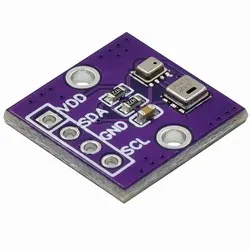
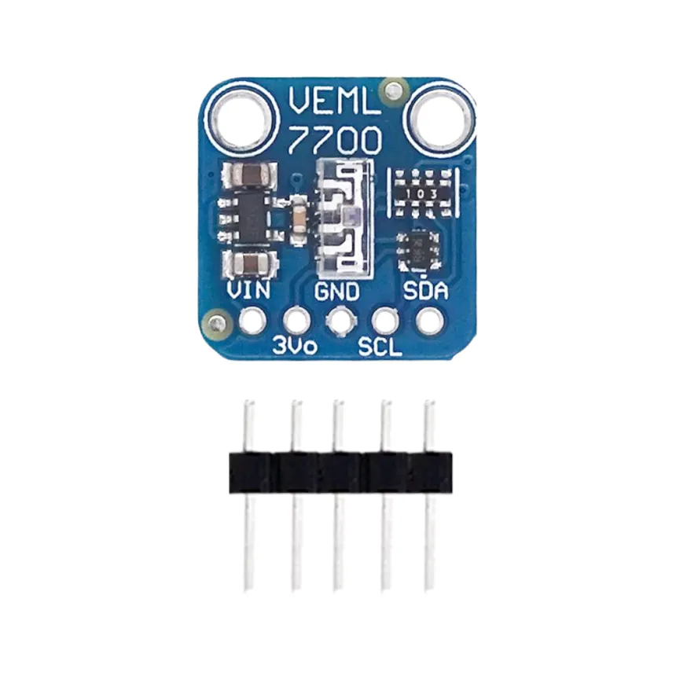
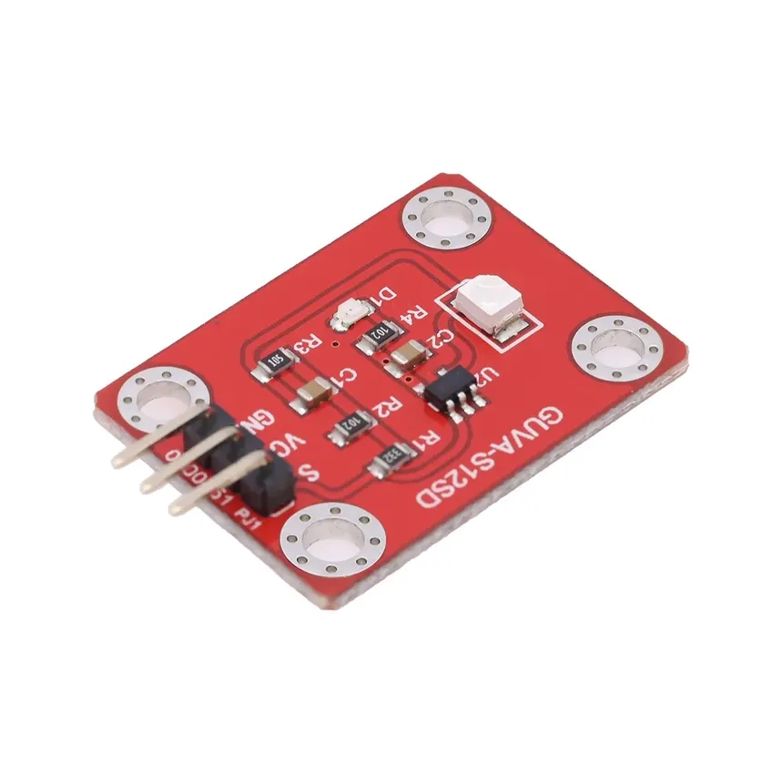
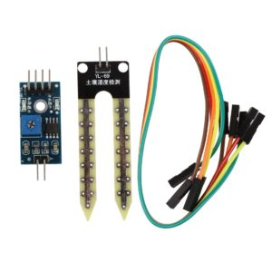
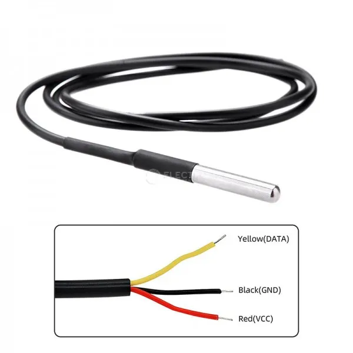
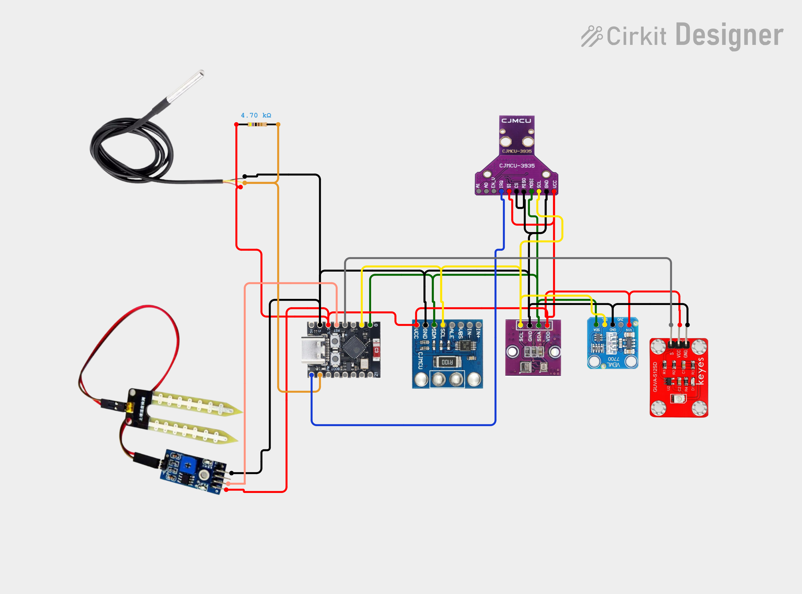
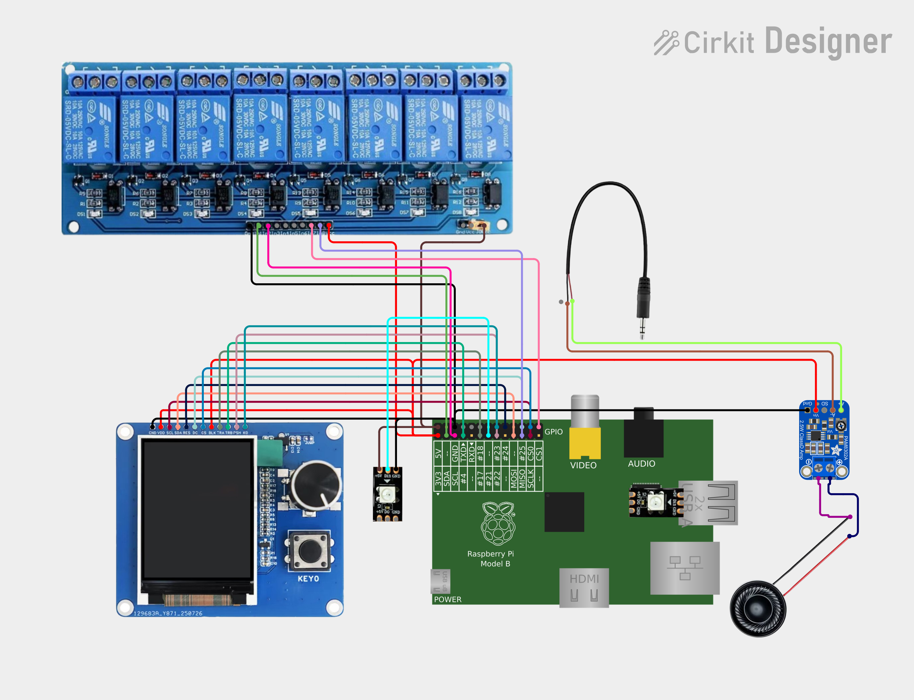
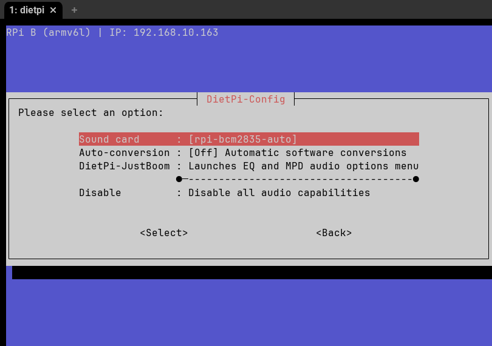

# Introducción

La idea para este trabajo es realizar un sistema completo de mediciones ambientales y del suelo para usarlo en agricultura, más orientada a horticultura o a regadío que a cultivos de cereales, aunque también sería aplicable. El sistema en principio lo he diseñado para usarlo en huertas al aire libre (no en invernadero) y realizará las siguientes mediciones in situ:

[Explicar por qué se mide cada cosa]

- Temperatura, humedad y presión atmosféricas.
- Iluminación.
- Índice UV: predecir el estrés fotoquímico de las plantas, el riesgo de quemaduras en hojas/frutos y el momento óptimo para la aplicación de ciertos tratamientos agrícolas
- Proximidad de tormentas.
- Humedad y temperatura del suelo.

Todas estas mediciones serán efectuadas por un nodo autónomo (ESP32-C3 SuperMini) que se instalaría en la propia huerta y cuyos datos se enviarán a una estación base (Raspberry Pi 1 Model B) para su procesamiento y envío a una plataforma IoT en la nube (Ubidots) para su análisis.

[Esquema del sistema]

La estación base dispondrá a su vez de una pantalla para visualización de los datos y/o alertas del sistema, botones que controlarán una serie de relés que, hipotéticamente, podrían activar bombas de riego, luces... y un altavoz que emitirá alertas (por ejemplo ante la proximidad de una tormenta) y avisos.

El sistema se diseñará, en esta primera etapa, con una conexión simple por el puerto USB entre el nodo autónomo y la estación base, con la idea de mejorar el sistema de comunicaciones entre ambos en la práctica final de la asignatura Comunicaciones Inalámbricas y Protocolos para el Internet de las Cosas y hacerlo escalable para que una sola estación base pueda gestionar múltiples nodos autónomos.

Cabe señalar que he decidido aprovechar buena parte del hardware que ya tenía para realizar esta práctica para ponerla en funcionamiento y realizar pruebas con hardware real, lo cual me parece imprescindible.

[Foto del sistema]

# Nodo solar autónomo

El nodo solar autónomo está compuesto de un ESP32-C3 Supermini de TENSTAR ROBOT[^3] como unidad de procesamiento. Este microcontrolador tiene las siguientes características:

- Procesador: CPU de 32 bits RISC-V con núclo único, operando a una frecuencia de hasta 160 MHz.
- Memoria: 4 MB de memoria Flash integrada, 400 KB de SRAM y 384 KB de ROM.
- Conectividad: Soporte integrado para Wi-Fi (protocolo 802.11 b/g/n en banda de 2.4 GHz) y Bluetooth 5.0 (BLE), con antena cerámica incorporada.
- Interfaces y Pines: 11 GPIOs digitales configurables (usables como PWM) y 4 entradas analógicas (ADC), además de interfaces UART, I2C, SPI e I2S.
- Alimentación y Consumo: Se alimenta mediante puerto USB Tipo C (5V) o pines de 3.3V, destacando por un consumo ultra bajo en modo deep sleep de aproximadamente 43 µA.
- Seguridad: Incluye aceleradores de hardware para cifrado (AES-128/256), hashing, arranque seguro (Secure Boot) y cifrado de flash.
- Indicadores y botones: LED azul integrado conectado al pin GPIO8 y botones físicos para reinicio y arranque.

Usaré para programar la extensión PlatformIO de VSCode con el framework Arduino que dispone de muchas librerías ya probados para los sensores que emplearé.

## Sensores ambientales

A este microcontrolador conectamos los siguientes sensores:

- AHT20+BMP280: mide temperatura, humedad relativa y presión atmosférica ambientales. El módulo que tengo combina ambos sensores y funciona por I2C. Uso las librerías de Adafruit para los AHTTX0[^5] y para el BMP280[^6].

- VEML7700: mide la luz ambiental real de forma lineal y con alta precisión y funciona por I2C. Rango de medición de 0 a 120.000 lux, detecta luz visible e IR. Uso la librería de Adafruit para el VEML7700[^7].

- GUVA-S12SD: calcula el índice UV para luces de longitudes de onda de 240nm a 370nm con salida analógica y salida entre 0 y 1 V. Lo leo directamente usando un pin ADC y lo convierto suponiendo que 1 V es un 10 en el índice de radicón ultravioleta.

- AS3935: usado para detectar rayos y estimar la distancia a la tormeta. Puede detectar rayos hasta a 40 km con una precisión de 1 km en 14 pasos. Tiene un pin de alerta que conecto al ESP32-C3 para avisar de descargas en tiempo real. Es sensible a las interferencias electromagnéticas (EMI) de los convertidores DC-DC, pantallas y el propio WiFi/Bluetooth del ESP32-C3 por lo que, idealmente, habría que situarlo en una caja estanca[^9] a cierta distancia del resto de componentes de nuestro nodo autónomo. Se puede conectar usando SPI o I2C, lo conecto usando I2C pese a que dicen que suele funcionar mejor usando SPI para economizar pines del microcontrolador. Uso la librería de SparkFun[^8] pese a que mi módulo (etiquetado como CJMCU[^10]) ni se parece al suyo, pero parece funcionar bien. Lo puedo activar usando el cuarzo de un mechero, así detecta a veces incluso un rayo para las pruebas, aunque la mayoría de las veces detecta solo interferencias o ruido, que internamente diferencia de los rayos de verdad usando algoritmos de validación de señal y picos configurables que yo, de momento, no he tocado.

## Sensores de suelo

- Higómetro de suelo FC-28: mide la humedad de la tierra usando un sensor simple por variación de conductividad[^11]. La placa de medición, que emplea un comparador LM393, devuelve valores analógicos o una señal alta digital cuando la humedad supera cierto umbral que podemos definir con un potenciómetro. Uso la salida analógica con el ADC de 12 bits del ESP32-C3 para obtener valores entre 0 y 4096. Metiendo el sensor en un vaso de agua calculo un valor de 1800 para 100% de humedad y 4096 para 0%, aunque tal como funciona este sensor sus mediciones solo deberían servirnos para saber si la tierra está húmeda o no, y no tener muy en cuenta el valor que devuelve.

- Sonda Sumergible DS18B20: mide la temperatura, en principio está diseñado para ser usado en el agua (yo los he usado en acuarios), pero aquí lo emplearemos enterrado en la tierra. Usa el protocolo One wire, empleo la librería de Paul Stoffregen[^12], pongo una resistencia de pull-up de 4,7KOhms (Si alargamos el cable habría que bajar el valor) entre VCC y DATA y lo leo con la librería de Miles Burton[^13].

## Alimentación

Alimento todo desde el ESP32-C3 alimentado a su vez por USB por estación base. Todos los sensores funcionan a 3,3V sacados del regulador interno del ESP32-C3.

He dejado conectado un módulo con un INA226 para medir voltajes y corrientes de alimentación por I2C (usando la librería de Rob Tillaart[^14]) porque mi idea inicial era usar un panel solar y una batería para alimentar el nodo autónomo, pero al establecer comunicación con la estación base usando USB, que trae su propia alimentación, me iba a complicar demasiado. La tarea de hacer el nodo autónomo realmente autosuficiente la dejo para la práctica final de la asignatura Comunicaciones Inalámbricas y Protocolos para el Internet de las Cosas.

# Estación base

Usaré mi vieja y fiable Raspberry Pi 1 Model b Rev1.0 que empleé para una de las prácticas de la asignatura Comunicaciones Inalámbricas y Protocolos para el Internet de las Cosas. Esta versión tiene las siguientes características relevantes:
- Procesador: Broadcom BCM2835 con núcleo único ARM1176JZF-S a 700 MHz.
- Memoria: 256 MB SDRAM (compartida entre CPU y GPU).
- Red: Puerto Ethernet RJ45 10/100 Mbps. Conectado a mi red local.
- USB: 2 puertos USB 2.0. Puentee los fusibles poliméricos integrados para no limitar la corriente con la que se alimentan los dispositivos USB.
- Almacenamiento: Tarjeta MicroSD de 64GB.
- GPIO: Cabecera de 26 pines (8 pines GPIO, más pines para I2C, SPI y UART). Los I2S no están completos como veremos más adelante.
- Alimentación: Entrada Micro USB, uso una fuente de 5V 3A.

## Pantalla

Uso un módulo con una Pantalla 2" pulgadas con una controladora ST7789 y 320x240 px de resolución con codificador rotatorio EC11 y un botón extra integrados (en la práctica 4 botones). La pantalla se conecta por SPI usando la librería Luma.LCD[^15]. con el encoder conectada a la raspberry pi para mostrar los datos recibidos de los nodos autónomos y un pequeño menú de control, también para parar las alertas y controlar manualmente los relés. Uso la librería Luma.LCD <https://luma-lcd.readthedocs.io/en/latest/>

## LED de estado

Uso un LED WS2812B, tenía un conflicto con la salida analógica de audio al usar GPIO18 que me costó depurar, el LED no funcionaba en mi programa pero sí en los que lo probaba solo, y el audio al tratar de hacer funcionar los dos a la vez sonaba mal, eso se debía a que ambos usa PWM y el mismo GPIO y se pisaban, cambiando el el LED al GPIO21 lo soluciono.

## Sonido

Conectar un amplificador (MAX98357 I2S 3W Class D Amplifier Module) con un altavoz de 8 Ohms y 0,5W también a GPIO para las alertas de tormenta y otras posibles alertas. No puedo por no tener I2S, uso un PAM8302A como amplificador conectado al jack de 3,5mm. Pruebo https://scruss.com/blog/2020/07/19/speech-on-raspberry-pi-espeak-ng/

## Relés

Usaré también un módulo con 8 relés a 5V Relay Module With Optocoupler para simular la apertura de válvulas de riego y la activación de otros sistemas (usamos sus LEDs para probar que funcione correctamente). Puede funcionar a 3,3V en principio si conecto JD-VCC a una fuente de 5V. Si faltan puertos en la RPi puede dejar sin conectar algunos relés. Activos en bajo.

## Alimentación

La estación base, y todos sus periféricos, se alimentan a través de de una fuente de 5V 3A conectada a la toma de alimentación de la Rasperry Pi. Tengo que arrancar la estación base con el nodo autónomo conectado porque si lo conecto después la Raspberry Pi se bloquea por el pico de potencia requerido, no es un gran inconveniente.

## Configuración inicial

Uso *DietPi*[^1] como imagen para la Raspberry Pi dado que es una imagen mínima y tendrá mejor rendimiento que una imagen de Raspbian completa.

Activo el audio instalando ALSA y configurando la tarjeta de sonido para que use la interna de la RaspberryPi, también activo SPI. Todo se hace desde la consola usando `dietpi-config`, la herramienta de configuración de DietPi.

## Programa de monitorización y control

No detallar el código aquí, solo cómo lo hago y qué hace y el diseño, quizás incluir algún gráfico.

Al conectar el ESP32 con la RPi arrancada se muere por el pico de energía, esto ya me pasaba, quizás lo polyfuses?

grupos dialout, gpio y spi

Para que funcione el LCD con las fuentes correctas además necesito los paquetes `libtiff6 libopenjp2-7 libxcb1 libfreetype6`
También hace falta que el usuario esté en los grupos `dialout audio spi gpio`

El LED no funciona, pruebo con esto <https://learn.adafruit.com/neopixels-on-raspberry-pi/python-usage> y funciona bien usando sudo eso sí.

Uso python-dotenv con el fichero pyproject.toml

[Esquema del programa o algún diagrama]

### Automatizaciones

Residen en el nodo base para ser independientes de internet y tener menor latencia, ahora una muy básica que enciende el relé 1 durante 10 segundos? cuando la humedad baja de un nivel preprogramado y no se puede repetir hasta 10 minutos después.

# Comunicaciones

Los datos se envían por serie desde el nodo autónomo a la estación base usando conexión serie a través de sus puertos USB en formato JSON con la librería ArduinoJSON[4].

[Formato del JSON empleado para mandar los datos]

# Plataforma IoT en la nube: Ubidots

Creo una cuenta gratuita en Ubidots STEM <https://stem.ubidots.com/app/dashboards/>

Envío los datos usando su API, leo también el estado de los relés desde Ubidots para poder activarlos a distancia. Tuve algún problema de rebote con esto al compartir en Ubidots estado del relé con su accionamiento.

# Mejoras futuras

Carcasa digna que no voy a diseñar para esta práctica
Uso de mosfet, como el Si2312 para apagar sensores cuando no se utilizan en el ESP32
Uso de otro protocolo de comunicaciones
Sensor de pluviometría con sensor de efecto hall o reed switch, con plato con balancín e imán de neodimio que vuelca el agua cuando alcanza determinado volumen, impreso en 3D.
Anemómetro y veleta para registrar velocidad y dirección del viento.
Usar ESP32-C6 que tienen mejor conectividad, aunque en nuestro caso nos da igual si no usamos WiFi
Firmware actualizable via OTA, uso de secure boot
Si el INA226 detecta que la batería cae por debajo del 20%, puedo hacer que el ESP32-C3 entra en un modo de ultra-bajo consumo (Deep Sleep prolongado) o desactiva lecturas secundarias para garantizar que la alerta de tormenta (AS3935) siga funcionando.
Asegurar bien la conexión MQTT.
Integrar los datos recibidos por la estación base en mi Home Assistant aprovechando que ThingsBoard usará el mismo broker que HA.

# Conclusiones

[^1]: DietPi - Lightweight justice for your SBC!. Disponible en: <https://dietpi.com/>. Accedido el 12/8/2026.
[^2]: ThingsBoard - Open-source IoT Platform. Disponible en: <https://thingsboard.io/>. Accedido el 23/8/2026.
[^3]: TENSTAR ROBOT - Placa de desarrollo TENSTAR ROBOT ESP32 C3 SuperMini Disponible en: <https://tenstar.pro/robot-esp32-c3-supermini/>. Accedido el 24/8/2026.
[^4]: GitHub - ArduinoJson. Disponible en: <https://github.com/bblanchon/ArduinoJson>. Accedido el 27/8/2026.
[^5]: GitHub - Adafruit AHTX0 (AHT10 & AHT20). Disponible en: <https://github.com/adafruit/Adafruit_AHTX0>. Accedido el 27/8/2026.
[^6]: GitHub - Adafruit BMP280 Driver (Barometric Pressure Sensor). Disponible en: <https://github.com/adafruit/adafruit_bmp280_library>. Accedido el 27/8/2026.
[^7]: GitHub - Adafruit_VEML7700. Disponible en: <https://github.com/adafruit/Adafruit_VEML7700>. Accedido el 27/8/2026.
[^8]: GitHub - SparkFun AS3935 Lightning Detector Arduino Library. Disponible en: <https://github.com/sparkfun/SparkFun_AS3935_Lightning_Detector_Arduino_Library>. Accedido el 27/8/2026.
[^9]: Garry's blog - Ben Franklin and DIY Lightning Detection using a AS3935 Lightning Sensor. Disponible en: <https://garrysblog.com/2025/07/23/ben-franklin-and-diy-lightning-detection-using-a-as3935-lightning-sensor/>. Accedido el 27/8/2026.
[^10]: Tasmota - AS3935 Franklin Lightning sensor. Disponible en: <https://tasmota.github.io/docs/AS3935/#cjmcu-board>. Accedido el 27/8/2026.
[^11]: DitecnoMakers - Medir la humedad de la tierra con Arduino y un Higrómetro FC-28. Disponible en: <https://tasmota.github.io/docs/AS3935/#cjmcu-board>. Accedido el 27/8/2026.
[^12]: PJRC - OneWire Arduino Library, connecting 1-wire devices (DS18S20, etc) to Teensy. Disponible en: <https://tasmota.github.io/docs/AS3935/#cjmcu-board>. Accedido el 27/8/2026.
[^13]: GitHub - Arduino Temperature Control Library. Disponible en: <https://github.com/milesburton/Arduino-Temperature-Control-Library>. Accedido el 27/8/2026.
[^14]: GitHub - Arduino library for the INA226 power sensor. Disponible en: <https://github.com/RobTillaart/INA226>. Accedido el 27/8/2026.